# Asio 开发架构文档

> 基于 [README.md](README.md) 编写 | 版本 1.38.2 | 许可证：Boost Software License 1.0
>
> 文中所有架构图、类图与时序图均采用 **Mermaid** 格式编写，在 GitHub、VS Code 及各类 Markdown 预览器中均可直接渲染。

---

## 1. 概述

Asio 是跨平台、仅头文件的 C++ 网络/底层 I/O 库。其架构围绕三个核心设计展开：

1. **Proactor 模式**：异步操作发起后立即返回，I/O 就绪与数据搬运由运行时完成，再回调用户处理器。
2. **I/O 对象 / 服务（Service）分离**：`basic_socket` 等前端 I/O 对象是轻量句柄，真正的状态与平台调用集中在按 `execution_context` 注册的单例服务中。
3. **可插拔异步完成模型**：同一套发起函数（initiating function）通过 `async_result` 机制适配回调、`future`、协程等多种完成令牌。

---

## 2. 基本概念

### 2.1 Proactor 模式与异步模型

| 角色 | 对应 Asio 实现 | 职责 |
|---|---|---|
| Initiator（发起者） | `async_read_some()` 等发起函数 | 发起异步操作并立即返回 |
| Completion Handler（完成处理器） | 用户回调 / 协程恢复点 | 接收最终结果（错误码 + 字节数等） |
| Completion Token（完成令牌） | 回调、`use_future`、`use_awaitable`、`deferred`… | 描述"结果如何交付" |
| Asio Operation（操作对象） | `detail::reactor_op` 等派生类 | 封装一次未完成异步操作的上下文 |
| Event Demultiplexer | `epoll/kqueue/IOCP/io_uring` | 等待 OS 层 I/O 事件 |
| Proactor | `io_context` + `detail::scheduler` | 派发完成的操作、调用处理器 |

### 2.2 I/O 上下文（io_context / execution_context）

- `execution_context`：轻量上下文基类，内含**服务注册表（service_registry）**，按类型提供全局单例服务。
- `io_context`：核心事件循环，继承自 `execution_context`。用户代码通过 `run()` / `poll()` 驱动它处理完成的异步操作。
- `thread_pool` / `system_context`：同样继承 `execution_context`，提供线程池执行环境。

### 2.3 执行器（Executor）与 Strand

- **Executor**：统一的调度接口（`dispatch` / `post` / `defer`），携带"在哪里、如何执行"的语义。
- **io_context::executor_type**：绑定到具体 `io_context` 的执行器，I/O 对象通过它获得关联的执行环境。
- **strand**：串行化适配器，保证经其派发的处理器不并发执行，是免锁编程的核心工具。
- **any_io_executor**：类型擦除执行器（类似 `std::function`），允许 I/O 对象在运行时持有任意执行器。
- **executor_work_guard**：工作守卫，防止事件循环因无未完成工作而提前退出。

### 2.4 完成令牌（Completion Token）与完成签名

- **完成签名（Completion Signature）**：形如 `void(error_code, std::size_t)` 的函数类型，描述完成处理器参数。
- **`async_result<CompletionToken, Signatures...>`**：核心定制点。默认情况下 `completion_handler_type == CompletionToken`（裸回调即令牌）；针对每种令牌提供特化：
  - `use_future_t` → 完成时 set 到 `std::future`，发起函数返回 future；
  - `use_awaitable_t` → 完成时恢复挂起的协程，发起函数返回 `awaitable<T>`；
  - `deferred_t` → 不立即执行，返回惰性操作对象；
  - `detached_t` → 忽略结果与异常。
- **`async_initiate`**：推荐使用的发起入口，内部转调 `async_result::initiate(...)`。

### 2.5 I/O 对象与服务（Service 模式）

- I/O 对象（如 `ip::tcp::socket`）仅持有一个 `detail::io_object_impl`，其中保存**服务指针**与**实现类型（implementation_type）**。
- 服务（如 `reactive_socket_service`）按 `io_context` 全局唯一（`use_service<T>()` 创建/获取），集中管理所有同类型 I/O 对象的底层状态。
- 好处：I/O 对象本身极轻（可值拷贝、移动），昂贵的平台资源与状态机集中在服务内。

### 2.6 缓冲区（Buffer）

- `mutable_buffer` / `const_buffer`：单块连续缓冲区的非拥有视图（指针 + 长度）。
- `buffer()` 自由函数：从数组、`vector`、`string` 等创建缓冲区视图，自动推导大小。
- 缓冲区序列（BufferSequence）：多块缓冲区组成的序列，支持 scatter/gather。
- `basic_streambuf`：动态缓冲区（派生自 `std::streambuf`），配合 `read_until` 等使用。

### 2.7 取消机制（Cancellation）

- `cancellation_signal`：发出取消请求的信号源。
- `cancellation_slot`：与一次异步操作关联的取消槽，操作发起时登记取消处理器。
- `cancellation_state` / `cancellation_type`：过滤取消类型（`terminal` / `partial` / `total`）。
- `cancel_after` / `cancel_at`：到相对/绝对时间点自动 emit 取消。

### 2.8 平台反应器（Reactor Backends）

`detail` 层按平台与编译期配置选择后端，公共代码无感知：

| 后端 | 平台/条件 | 服务层对应 |
|---|---|---|
| `epoll_reactor` | Linux | `reactive_socket_service` 等 |
| `kqueue_reactor` | macOS / BSD | 同上 |
| `select_reactor` / `dev_poll_reactor` | 兜底 / Solaris | 同上 |
| `win_iocp_io_context` | Windows IOCP | `win_iocp_socket_service` 等 |
| `io_uring_service` | Linux io_uring | `io_uring_socket_service` 等 |
| WinRT 系列 | UWP | `winrt_*_service` |

---

## 3. 总体分层架构

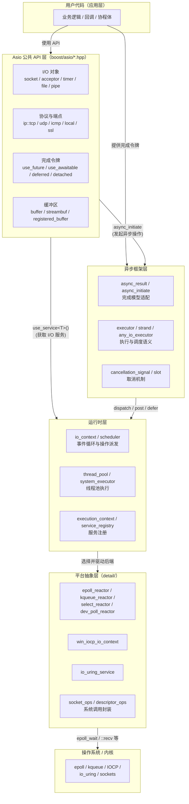

---

## 4. 关键 UML 类图

### 4.1 核心运行时与 Service 模式

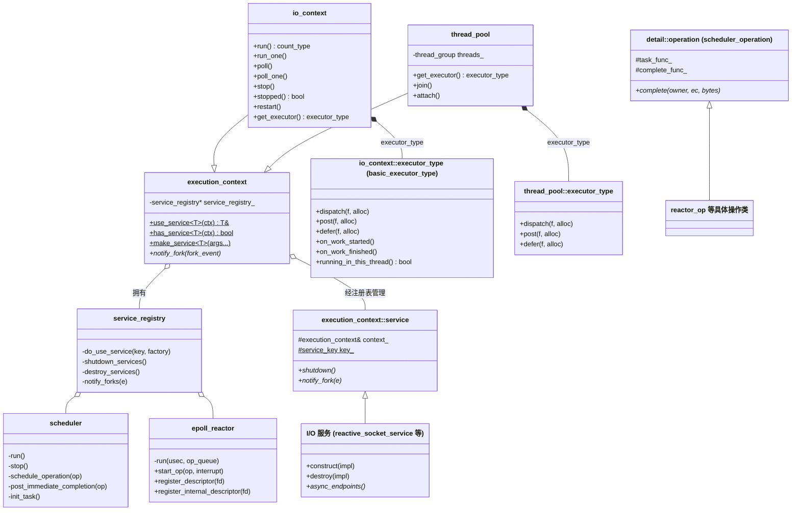

### 4.2 Socket 类层次与协议

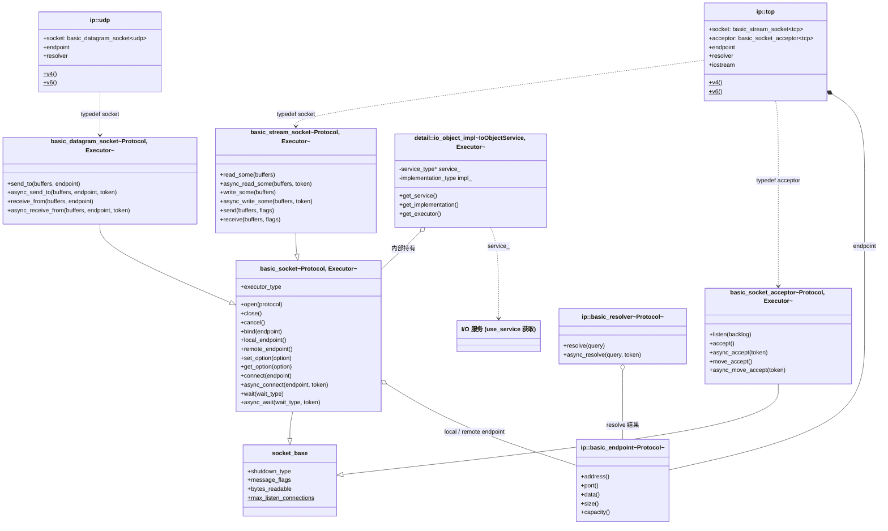

### 4.3 定时器类层次

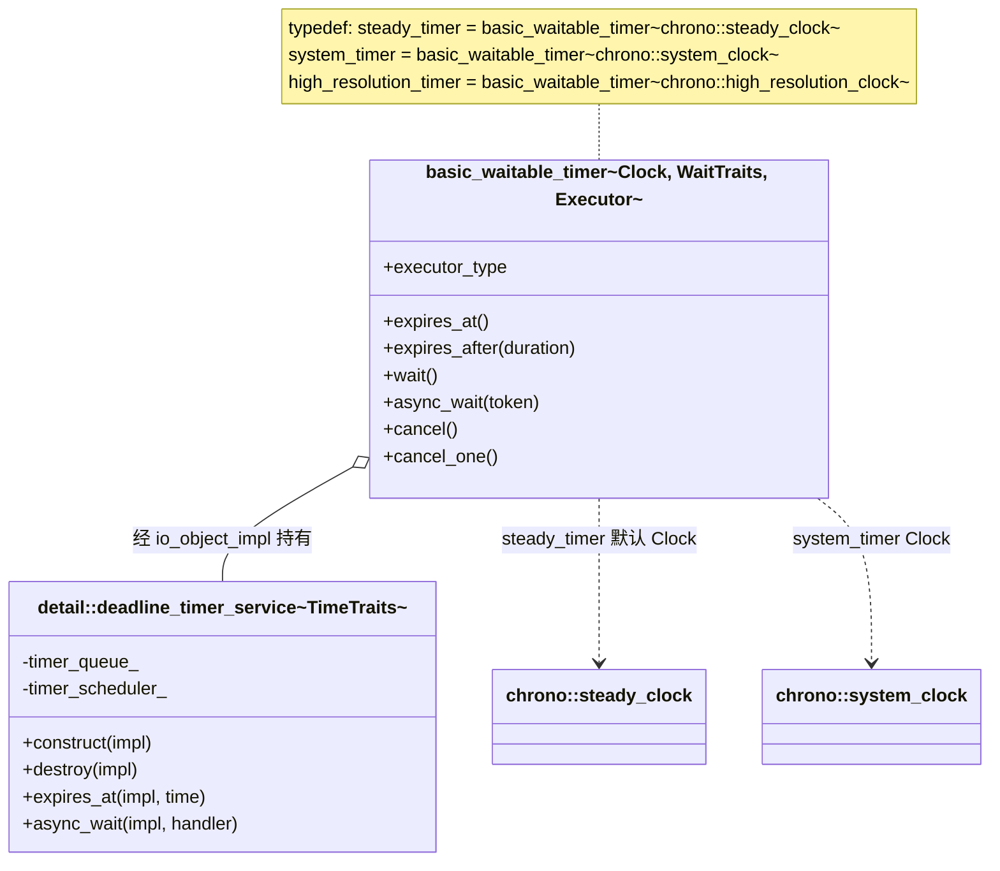

### 4.4 异步完成模型（async_result / Completion Token）

这是 Asio 最关键的编译期架构：**同一发起函数，通过 `async_result` 特化适配多种交付风格**。

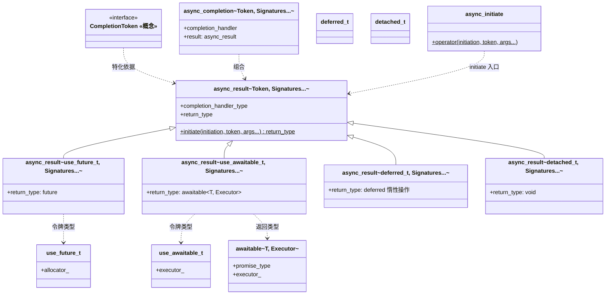

### 4.5 SSL 流类层次（装饰器模式）

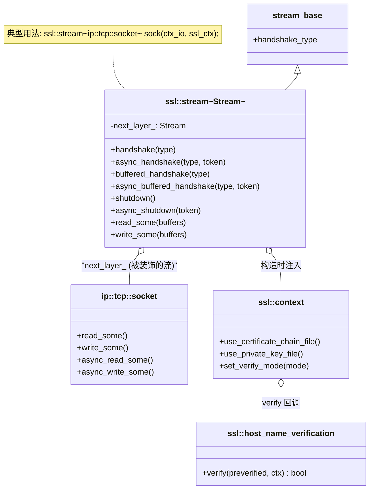

### 4.6 取消机制类图

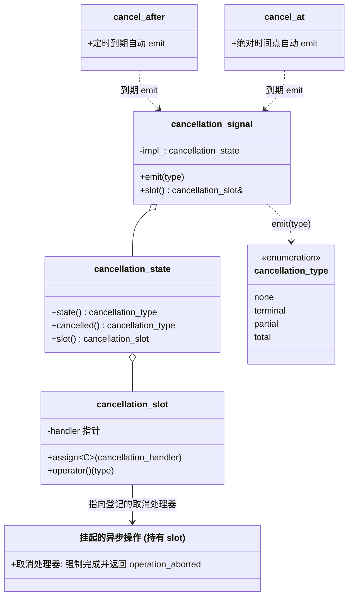

---

## 5. 关键 UML 流程图

### 5.1 io_context.run() 事件循环

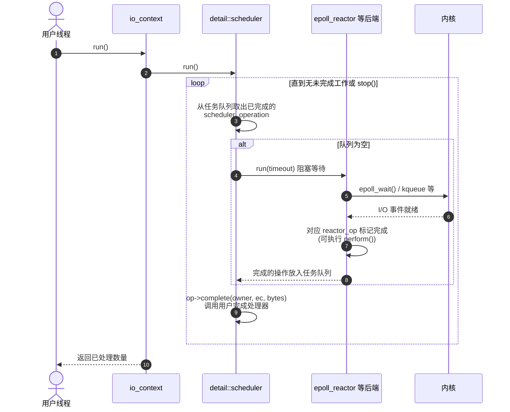

### 5.2 同步读操作流程

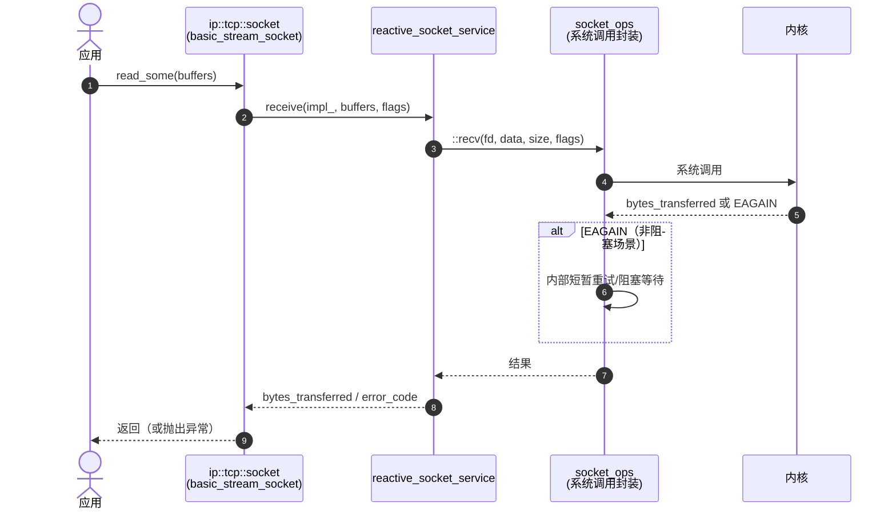

### 5.3 异步读操作流程（回调风格）

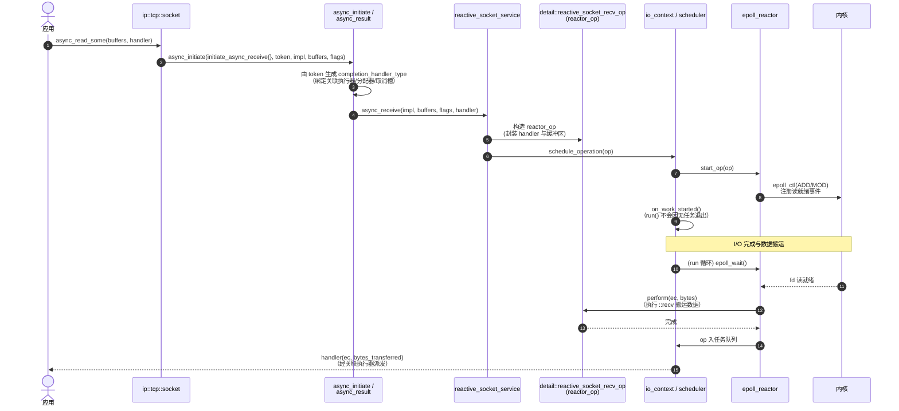

### 5.4 协程异步流程（co_spawn / use_awaitable）

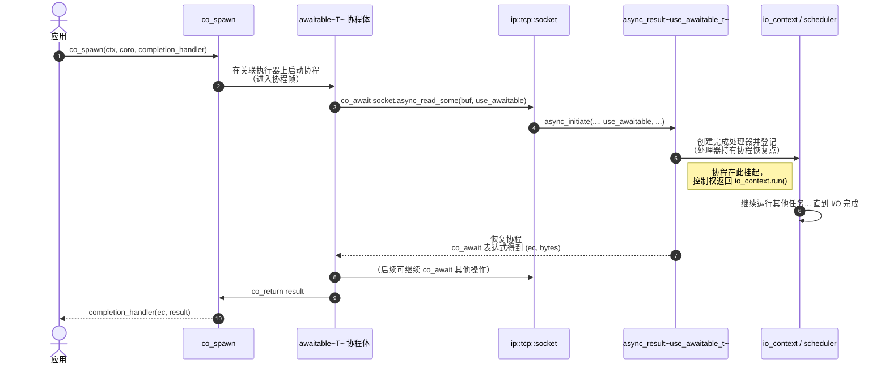

### 5.5 TCP 服务器：连接接受流程

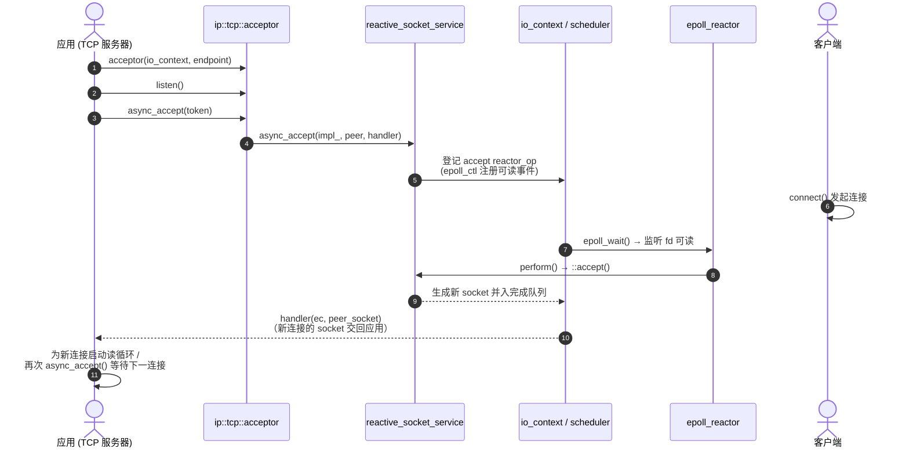

### 5.6 定时取消流程（cancel_after）

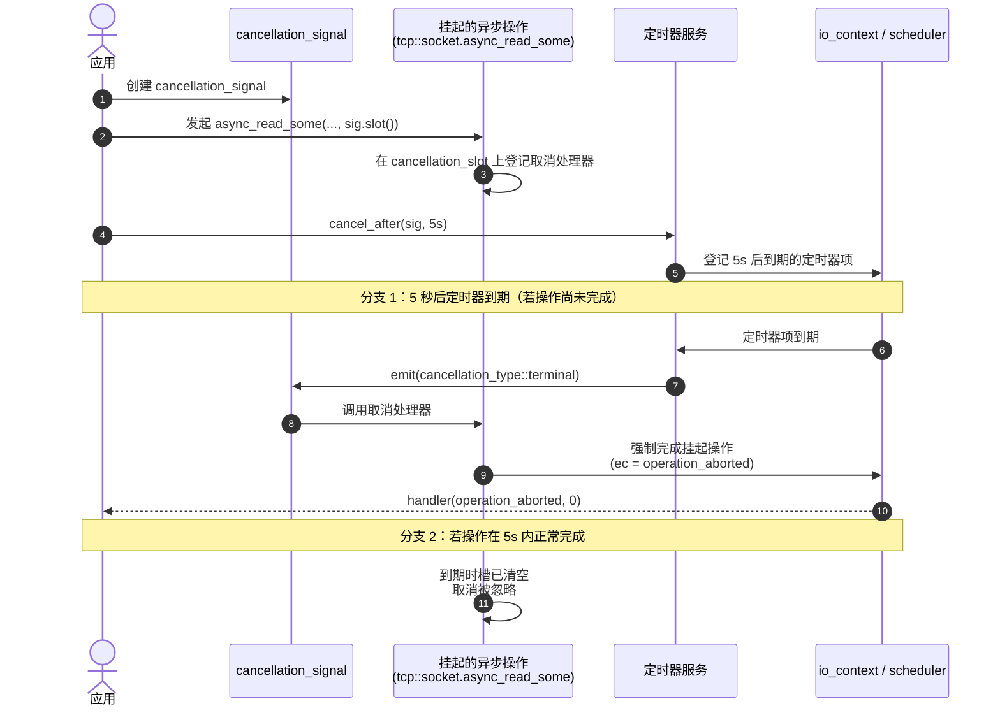

---

## 6. 线程模型与线程安全

| 对象 | 多线程共享 | 说明 |
|---|---|---|
| `io_context` | 需外部同步或 strand | 多线程可同时调用 `run()`，但共享 I/O 对象的处理器需 `strand` 串行化 |
| I/O 对象（socket 等） | 不安全 | 官方约定：不同对象之间安全，同一对象共享不安全（显式说明的除外） |
| `strand` | 安全 | 保证经其派发的处理器互斥执行 |
| `execution_context::service` | 安全 | 服务内部自行保证状态一致性 |
| `thread_pool` | 安全 | 设计为多线程提交任务 |

---

## 7. 扩展点

| 扩展点 | 机制 | 用途 |
|---|---|---|
| 自定义完成令牌 | 特化 `async_result<Token, Signatures...>` | 接入自定义异步交付风格 |
| 自定义执行器 | 满足 Executor 概念（`execute()` + 关联 `execution_context`） | 自定义调度策略 |
| 自定义 I/O 服务 | 继承 `execution_context::service` + `use_service<T>()` 注册 | 注入自定义服务（如 asio 自身的 `ssl` 即以服务方式扩展） |
| 自定义协议 | 定义 Protocol 类型（含 `endpoint` / `socket` / `acceptor` typedef） | 复用 `basic_*` 模板接入新协议（`generic/` 已内置通用协议） |
| 处理器追踪 | `BOOST_ASIO_ENABLE_HANDLER_TRACKING` + `tools/handler*.{pl}` | 调试异步调用链（`handlerviz.pl` 可视化） |

---

## 8. 附录：关于图表渲染（Mermaid）

本文所有架构图、类图与时序图均采用标准 **Mermaid** 格式编写：

- **GitHub / GitLab**：开箱即用，无需任何插件或额外依赖，在线即可直接原生渲染为清晰的矢量图。
- **VS Code / Cursor**：原生 Markdown 预览器（`Ctrl+Shift+V` 或 `Cmd+Shift+V`）内置 Mermaid 渲染支持。
- **命令行导出**：如需将图表批量导出为图片或离线文档，可使用 `@mermaid-js/mermaid-cli`：
  ```bash
  # 使用 mmdc 导出离线预览
  npx -y @mermaid-js/mermaid-cli -i ARCHITECTURE.md -o ARCHITECTURE.pdf
  ```

---

## 参考链接

- [README.md](README.md) —— 本仓库代码树与模块功能说明
- `doc/overview/` —— 概念性概览（异步模型、执行器、缓冲区等官方文档源）
- `doc/net_ts.qbk` —— Networking TS 兼容性说明
