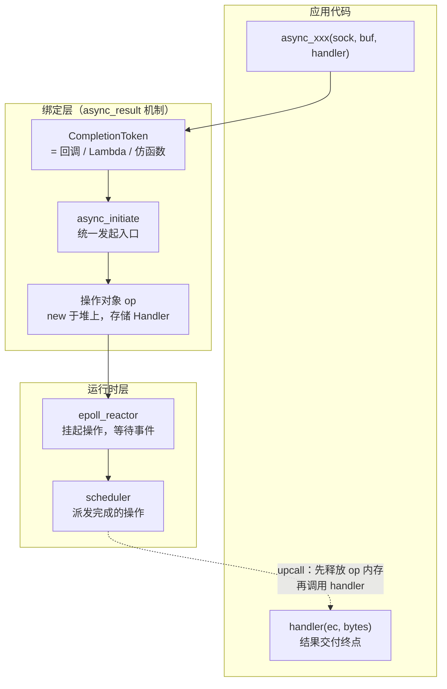
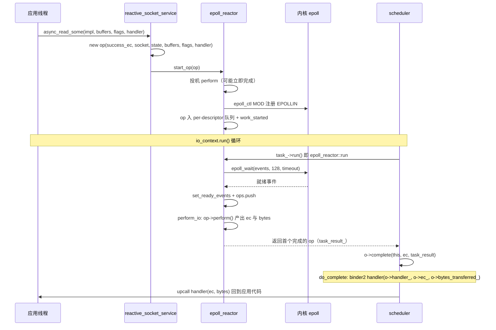
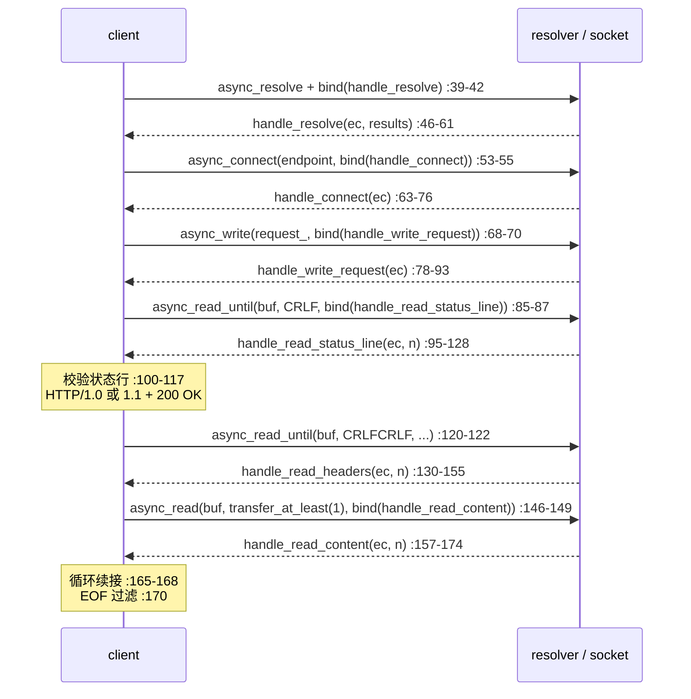
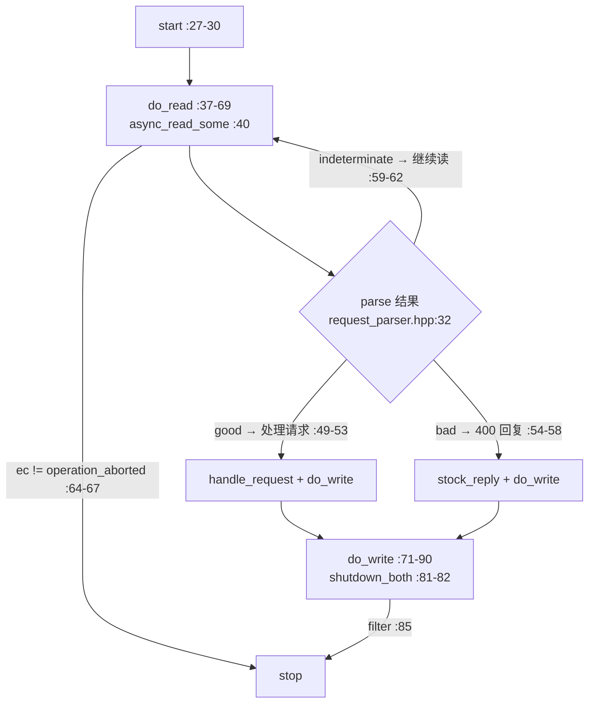
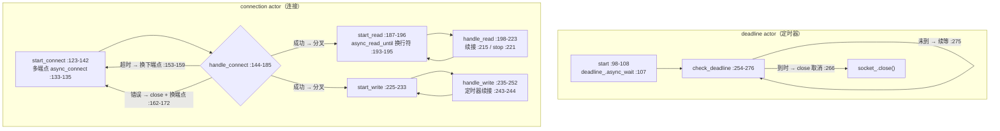

# Asio 回调与处理函数：异步完成通知与任务链状态机

> 基于 [README.md](README.md) 与 [ARCHITECTURE.md](ARCHITECTURE.md) 编写 | 版本 1.38.2
>
> 所有结论均标注源码出处（行号对应源文件）；所有图均为 **Mermaid** 格式。

---

## 1. 核心概念：回调是异步结果的交付终点

Asio 的每个异步操作（`async_xxx`）发起后**立即返回**，真正的 I/O 等待与数据搬运由运行时完成。**Completion Handler（完成处理器）**——用户提供的可调用对象——是操作结果（错误码 + 字节数等）的唯一交付终点（ARCHITECTURE.md §2.1 角色表）。

### 1.1 Handler 的三种形态

| 形态 | 写法 | 本仓库示例 | 说明 |
|---|---|---|---|
| 回调成员函数 + `std::bind` | `std::bind(&client::handle_resolve, this, _1, _2)` | `example/cpp11/http/client/async_client.cpp:39-42` | 传统写法，C++03 兼容，签名实参按占位符转发 |
| Lambda（推荐） | `[this, self](error_code ec, size_t n){...}` | `example/cpp11/chat/chat_client.cpp:56` 起 | 续接逻辑就地定义，配合 `shared_from_this` 管生命周期 |
| 仿函数 / 自定义类 | 定义了 `operator()` 的可调用对象 | 库内要求即 `async_result.hpp:313`：`completion_handler_type == CompletionToken` | 唯一契约是"可用 `handler(ec, args...)` 调用" |

> **陷阱提示**：`std::bind` 会**忽略多余实参**。`example/cpp11/timeouts/async_tcp_client.cpp:107` 将无参的 `check_deadline()` 绑定为 `deadline_.async_wait` 的处理器——完成签名是 `void(error_code)`，多出的实参被 bind 丢弃，这正是它能工作的原因。

### 1.2 从用户调用到回调执行：角色总览



---

## 2. 完成签名总表

**完成签名（Completion Signature）**是形如 `void(error_code, std::size_t)` 的函数类型，是 Handler 参数的契约。本仓库各异步 API 的签名（均已核实）：

| API | 完成签名 | 源码位置 | 备注 |
|---|---|---|---|
| `basic_stream_socket::async_read_some` | `void(error_code, std::size_t)` | `basic_stream_socket.hpp:1043-1044, :1070-1085` | 单次读，可能读到部分字节 |
| `basic_stream_socket::async_write_some` | `void(error_code, std::size_t)` | `basic_stream_socket.hpp:1092-1124` | 单次写 |
| `basic_socket_acceptor::async_accept`（仅 peer） | `void(error_code)` | `basic_socket_acceptor.hpp:1326-1327, :1357-1373` | handler 不会在本函数内被调用（:1310-1324 文档） |
| `async_accept`（peer + endpoint） | `void(error_code)` | `basic_socket_acceptor.hpp:1488-1498` | 端点在 handler 调用前由库填入引用参数 |
| `async_move_accept` | `void(error_code, Protocol::socket)` | `basic_socket_acceptor.hpp:1628` 起 | **socket 所有权经 handler 参数传递**（move-accept） |
| `basic_socket_acceptor::async_wait` | `void(error_code)` | `basic_socket_acceptor.hpp:1224-1232` | wait_type（readable / writable） |
| `basic_socket::async_connect`（成员） | `void(error_code)` | `basic_socket.hpp:965-984` | 未打开时自动 open（:975-980） |
| 自由函数 `async_connect` | `void(error_code, Protocol::endpoint)` | `connect.hpp:628-652` | 多端点时逐个尝试，handler 收到最后使用的端点（doc :657-661） |
| 自由函数 `async_read` | `void(error_code, std::size_t)` | `read.hpp:830-846` | 读满 completion_condition（如 `transfer_at_least(1)`） |
| 自由函数 `async_read_until` | `void(error_code, std::size_t)` | `read_until.hpp:123, :1660-1684` | **bytes 含分隔符本身** |
| `basic_resolver::async_resolve` | `void(error_code, results_type)` | `ip/basic_resolver.hpp:642-656` | 解析结果以值传入 handler |
| `basic_waitable_timer::async_wait` | `void(error_code)` | `basic_waitable_timer.hpp:576-577, :592` | 被取消时以 `operation_aborted` 完成 |

---

## 3. Handler 的绑定与存储：async_read_some 四步源码之旅

以 `sock.async_read_some(buffer, handler)` 为例（最常见的流式读），Handler 从用户栈走到堆上操作对象的完整路径：

**第 1 步 —— 发起函数包装签名并转调 `async_initiate`**

`include/boost/asio/basic_stream_socket.hpp:1070-1085`：

```cpp
template <typename ReadToken>
auto async_read_some(const MutableBufferSequence& buffers, ReadToken&& token)
  -> decltype(async_initiate<ReadToken, void(error_code, std::size_t)>(
        initiate_async_receive(this), token, buffers, message_flags(0)))  // :1070-1084
{
  return async_initiate<ReadToken, void(error_code, std::size_t)>(
      initiate_async_receive(this), token, buffers, message_flags(0));    // :1083-1085
}
```

完成签名 `void(error_code, std::size_t)` 在此处首次定型（:1043-1044 文档）。

**第 2 步 —— `async_result` 定制点：裸回调即 Handler**

`include/boost/asio/async_result.hpp:308-340`（默认特化 `completion_handler_async_result`）：

- :313 `typedef CompletionToken completion_handler_type;` —— **默认情况下传入的回调本身就是 handler 类型**，无任何包装；
- :327-333 `initiate()` 直接执行 `initiation(token, args...)` —— 把回调原样转发给下一层。

对应的 legacy 路径（`async_completion`，:459-491）：显式推导 handler 类型（:467-469）并构造 handler 对象（:476-482）；现代入口 `async_initiate` 在 :671-687，legacy 回退在 :720-733。

**第 3 步 —— 服务层：分配操作对象并存储 Handler**

`include/boost/asio/detail/reactive_socket_service_base.hpp:395-434`：

```cpp
// :405-411 源码注释 "Allocate and construct an operation to wrap the handler"
reactive_socket_recv_op<MutableBufferSequence, Handler, io_executor>* op =
  new (p.v) reactive_socket_recv_op<...>(
      success_ec_, impl.socket_, impl.state_, buffers, flags, handler, io_ex); // :407-409
// :414-419 取消槽：将 cancellation_slot 与该次操作关联
// :421-422 ASIO_HANDLER_CREATION(...)
// :424-432 start_op(impl.socket_, impl.state_, op, ...) → :433 所有权转移给 reactor
```

**第 4 步 —— 结论**

| 阶段 | Handler 状态 | 源码 |
|---|---|---|
| 用户调用时 | 栈上的可调用对象（无包装） | `async_result.hpp:313` |
| 进入服务层后 | **堆上操作对象的成员** `handler_` | `reactive_socket_service_base.hpp:405-411` |
| 挂起期间 | 由 reactor 的 per-descriptor 队列持有 | `epoll_reactor.ipp:347-348` |
| 完成后 | 移到栈上，op 内存先释放，再 upcall | `reactive_socket_recv_op.hpp:162-172` |

---

## 4. 完成通知路径：一次 async_read_some 的完整旅程



逐步说明：

1. **发起**：应用线程调用 `async_read_some`，Handler 被存入堆上操作对象（§3）。
2. **挂起**：`epoll_reactor::start_op`（`epoll_reactor.ipp:259-349`）先**投机 perform**（:288，数据已就绪可立即完成，省去 epoll 往返）；未完成则 `epoll_ctl(MOD)` 注册 EPOLLIN（:313/:343），操作入 per-descriptor 队列并 `work_started()`（:347-348，保证 `io_context.run()` 不退出）。
3. **等待**：`scheduler::do_run_one`（`scheduler.ipp:460-509`）发现队列头是 `task_operation_`，执行 `task_->run()`（:473-489）——即 `epoll_reactor::run`（`epoll_reactor.ipp:505-529`），`epoll_wait`（:529）阻塞等待内核事件。
4. **事件到达**：就绪描述符状态由 `descriptor_state::set_ready_events` 记录（`epoll_reactor.hpp:75`，事件掩码存入 `task_result_`），相关操作推入完成队列（`epoll_reactor.ipp:596-605`）。
5. **执行 I/O**：`descriptor_state::perform_io`（`epoll_reactor.ipp:784-821`）逐个执行操作：`op->perform()`（:800）——对读操作即 `reactive_socket_recv_op::do_perform`（`reactive_socket_recv_op.hpp:52-108`），调用 `socket_ops::non_blocking_recv*`（:64-68/:82-85）产出 `o->ec_` 与 `o->bytes_transferred_`；EOF 时 bytes==0 → `done_and_exhausted`（:97-102）。
6. **返回完成操作**：首个完成的操作由 `perform_io` 直接返回（:816-820），经 `task_result_` 交给 scheduler（`scheduler.ipp:493`）。
7. **派发**：`scheduler::do_run_one` 调用 `o->complete(this, ec, task_result)`（:504-505，源码注释 "Complete the operation. May throw an exception. Deletes the object."）→ `scheduler_operation.hpp:38-42` 转调函数指针 `func_(owner, this, ec, bytes)`（**非虚函数**，:31-33）→ `reactive_socket_recv_op::do_complete`（:138-175）。
8. **Upcall**：`do_complete` 物化完成签名——`binder2<Handler, error_code, size_t> handler(o->handler_, o->ec_, o->bytes_transferred_)`（:162-163）；先 `p.reset()` 释放 op 内存（:165），再 `w.complete(...)`（:172）调用用户 Handler。`executor_op::do_complete`（`executor_op.hpp:45-74`）同构：:63 handler 移栈、:64 释放、:66-73 upcall。

关键机制表：

| 机制 | 源码 | 说明 |
|---|---|---|
| 操作对象派发 | `scheduler_operation.hpp:31-33` | 函数指针 `func_(owner, this, ec, bytes)`，非虚函数（避免开销） |
| 完成语义 | `scheduler_operation.hpp:38-42` | `complete()`（owner≠0）= 接管并回调；`destroy()`（owner=0）= 仅销毁 |
| epoll 事件传递 | `epoll_reactor.ipp:830` | 事件掩码经 `bytes_transferred` 形参传入 do_complete |
| 内存安全 | `executor_op.hpp:63-64` | handler 移栈后先释放 op 内存再 upcall |
| 多操作收尾 | `epoll_reactor.ipp:816-820` | 首个 op 立即返回，其余由 io_cleanup 重排后续派发 |

---

## 5. error_code 与 bytes_transferred 语义

### 5.1 值的产出与传递

| 值 | 产出点 | 传递路径 | 语义 |
|---|---|---|---|
| `error_code` | `reactive_socket_recv_op::do_perform` → `socket_ops::non_blocking_recv*(..., o->ec_, ...)`（`reactive_socket_recv_op.hpp:64-68/:82-85`） | `do_complete` 时并入完成签名（:162-163） | `!ec` 成功；`operation_aborted` 被取消；其余系统错误（`epoll_reactor.ipp:319-320` errno→system_category） |
| `bytes_transferred` | 同上 | 同上 | 成功传输的字节数 |
| `task_result_` | `descriptor_state::set_ready_events`（`epoll_reactor.hpp:75`） | scheduler 派发时作为 `bytes` 实参（`scheduler.ipp:493, :504-505`；字段注释 "Passed into bytes transferred" 见 `scheduler_operation.hpp:70-72`） | 对 I/O 操作是 **epoll 事件掩码**（`epoll_reactor.ipp:830` `events = bytes_transferred`），并非用户字节数 |
| 用户 bytes | `do_complete` 的 binder（`reactive_socket_recv_op.hpp:162-163`） | upcall 实参 | 用户 handler 收到的字节数 |

### 5.2 特殊值判定

- **EOF**：`bytes_transferred == 0` 且 `!ec` → 对端关闭。库内以 `done_and_exhausted` 标记（`reactive_socket_recv_op.hpp:97-102`；枚举 `{not_done, done, done_and_exhausted}` 见 `reactor_op.hpp:28/:39/:43`）。应用层过滤示例：`async_client.cpp:170`。
- **取消**：`ec == operation_aborted`——`close()` / cancel 使挂起操作以此完成（`epoll_reactor.hpp:144-146` cancel_ops 文档 "operation_aborted"）。应用层过滤示例：`connection.cpp:64/:85`。
- **read_until 的 bytes 含分隔符**：`read_until.hpp:123` 明确。
- **超时**：定时器 `async_wait` 被取消时以 `operation_aborted` 完成（`async_tcp_client.cpp:266` 用 `socket_.close()` 触发整链取消）。

---

## 6. 异步任务链与状态机推进：四个源码实证

Handler 驱动的业务流程 = **每个 handler 内发起下一跳异步操作**。以下四个示例覆盖三种典型推进结构。

### 6.1 HTTP 客户端：五跳线性回调链

`example/cpp11/http/client/async_client.cpp`（204 行，`std::bind` + 成员函数）

链路：resolve → connect → write 请求 → 读状态行 → 读头 → 循环读 body



要点：

- 每跳 handler 第一件事检查 `ec`；
- 两次 `async_read_until`（`"\r\n"`、`"\r\n\r\n"`）以分隔符切分协议阶段；
- body 用 `async_read` + `transfer_at_least(1)` 循环续接（:165-168），EOF（bytes==0）时停止（:170）。

### 6.2 HTTP 服务端：读-解析-写状态机

`example/cpp11/http/server/connection.cpp`（93 行）+ `request_parser.hpp`（96 行）

`parse()` 返回三元结果 `{good, bad, indeterminate}`（`request_parser.hpp:32`），驱动状态机分叉：



要点：

- **indeterminate 回环**：HTTP 头未读完时回到 `do_read`——状态机的"等待更多输入"分支，是回调链里少见的显式回环；
- 错误与取消分流：`ec != operation_aborted` 才 stop（:64-67），服务器主动 shutdown 触发的取消不视为错误（同 SESSION_LIFECYCLE.md §3.2）；
- 解析器内部状态枚举：`request_parser.hpp:68-90`。

### 6.3 chat 客户端：lambda 就地续接 + 写队列

`example/cpp11/chat/chat_client.cpp`（167 行，纯 lambda 链）

- `do_connect()`（:53-63）：`async_connect` + 就地 lambda `[this](ec, tcp::endpoint){ if (!ec) do_read_header(); }` —— **续接逻辑内联在发起处**；
- 读链：`do_read_header`（:65-80，`async_read_until("\r\n")`）→ `do_read_body`（:82-99，`async_read_until("\r\n\r\n")`）→ 输出消息 → 回到 `do_read_header` 形成读回环；
- 写侧：`write()`（:33-45）将消息 post 入写队列，`do_write`（:101-121）逐条 `async_write`，队列非空则续写下一条 —— **"每 socket 单写"惯用法**（与 chat_server 的 `write_in_progress` 同源，SESSION_LIFECYCLE.md §3.3）；
- 任一跳出错：`socket_.close()` → 全链以 `operation_aborted` 退场。

### 6.4 timeouts/async_tcp_client.cpp：actor 模式与 actor 分叉

`example/cpp11/timeouts/async_tcp_client.cpp`（311 行，`std::bind` + actor 模式，文件头 :26-85 有 ASCII actor 图）

两个独立 actor 的控制流：



要点：

- **actor 分叉**：连接成功后 connection actor 分裂为读、写两个并发 actor（:180 `start_read` + :183 `start_write`），共享同一 socket；
- **取消即状态机控制流**：deadline actor 到时 `socket_.close()`（:266），挂起的读/写/连接以 `operation_aborted` 完成，对应 handler 据此换端点或收场——定时器不参与业务分支，而是通过取消驱动其他 actor；
- `handle_connect` 中超时/错误都回到 `start_connect` 尝试下一端点（:153-159/:162-172）；
- `main`：同步 resolve（:301）、`io_context.run()`（:303）。

### 6.5 推进结构小结

| 结构 | 示例 | Handler 形态 | 业务状态存放 |
|---|---|---|---|
| 线性链 | `http/client/async_client.cpp` | 成员函数 + `std::bind` | 成员变量（协议阶段隐含在调用顺序中） |
| 回环 + 分叉状态机 | `http/server/connection.cpp` | lambda | 解析器状态机（`request_parser.hpp:68-90`）+ reply |
| 读回环 + 写队列 | `chat/chat_client.cpp` | lambda | 写队列（:33-45） |
| 多 actor + 取消驱动 | `timeouts/async_tcp_client.cpp` | 成员函数 + `std::bind` | 各 actor 的 deadline/缓冲区；socket 关闭为全局信号 |

---

## 7. 回调链 vs 协程：状态管理的两种哲学

详细对比见 [SESSION_LIFECYCLE.md](SESSION_LIFECYCLE.md) §7.5 与 §10。要点：

| 维度 | 回调链（本文） | 协程（co_spawn / awaitable） |
|---|---|---|
| 状态存放 | 分散在各 handler 逻辑 + 成员变量 | 集中在协程帧（局部变量隐式持有） |
| 续接方式 | 手动调用下一跳 async 操作 | `co_await` 隐式挂起/恢复 |
| 生命周期 | 需 `shared_from_this` + 按值捕获（SESSION_LIFECYCLE.md §2） | 协程帧由 `co_spawn` / 库持有 |
| 错误处理 | 每跳检查 `ec` | try/catch + co_return |
| 完成机制 | 用户 handler 是交付终点 | `use_awaitable` 的完成处理器内部持有协程恢复点——**机制同构，由库代管** |

回调模式仍是协程的基础：`use_awaitable_t` 等完成令牌特化（`async_result.hpp`，见 ARCHITECTURE.md §2.4）只是把"恢复协程"作为 `completion_handler_type` 注入 §4 的同一条通知路径。

---

## 8. 反模式与最佳实践

### 反模式（均会导致 UB 或逻辑错误）

| 反模式 | 后果 | 正解 |
|---|---|---|
| handler 裸捕获 `this`，无存活保证 | use-after-free（SESSION_LIFECYCLE.md §1） | `enable_shared_from_this` + 按值捕获 self |
| 不检查 `ec` 就继续读 | 死循环 / 错误扩散 | 每跳先判 `!ec`，再分流 EOF / 取消 / 错误 |
| 把取消当错误处理 | 主动 shutdown 触发误报 | `ec != operation_aborted` 过滤（`connection.cpp:64/:85`） |
| 并发 `async_write` 同一 socket | 数据交错 | 写队列（`chat_client.cpp:101-121`） |
| 依赖 `async_read_some` 读满 N 字节 | 部分读 | `async_read` + completion_condition（`read.hpp:830-846`） |
| 忘记 read_until 的 bytes 含分隔符 | 协议解析错位 | 文档明确（`read_until.hpp:123`） |

### 最佳实践（源自本仓库示例）

- 每跳 handler 首行检查 `ec`；
- EOF（bytes==0）与取消（operation_aborted）是两条独立出口，分别处理；
- 定时器超时用 `close()` 触发整链取消，而非在业务里轮询（`async_tcp_client.cpp:266`）；
- `io_context.run()` 需挂起操作或 work_guard 维持（ARCHITECTURE.md §2.3）；
- 调试：`BOOST_ASIO_ENABLE_HANDLER_TRACKING` + `tools/handlerlive.pl` / `handlertree.pl` / `handlerviz.pl`（handler 追踪文档：`doc/overview/handler_tracking.qbk`）；官方概念图：`doc/overview/proactor.dot`、`doc/overview/async_op1.dot`。

---

## 9. 参考源码表

| 文件 | 角色（关键行号） |
|---|---|
| `include/boost/asio/async_result.hpp` | 完成模型定制点（:308-340 默认特化、:459-491 async_completion、:671-687 async_initiate、:720-733 legacy 回退） |
| `include/boost/asio/basic_stream_socket.hpp` | 发起函数模板（:1070-1085 async_read_some、:1092-1124 initiate_async_send、:1126-1158 initiate_async_receive） |
| `include/boost/asio/basic_socket.hpp` | 成员 async_connect（:965-984） |
| `include/boost/asio/connect.hpp` | 自由函数 async_connect（:628-652，多端点 doc :657-661） |
| `include/boost/asio/read.hpp` / `read_until.hpp` | 组合读操作（:830-846 / :123, :1660-1684） |
| `include/boost/asio/basic_socket_acceptor.hpp` | async_accept / move_accept / async_wait（:1224-1232, :1310-1324, :1326-1373, :1488-1498, :1628 起） |
| `include/boost/asio/basic_waitable_timer.hpp` | timer async_wait（:576-577, :592） |
| `include/boost/asio/ip/basic_resolver.hpp` | async_resolve（:642-656） |
| `include/boost/asio/detail/reactive_socket_service_base.hpp` | 服务层操作对象分配（:395-434） |
| `include/boost/asio/detail/reactive_socket_recv_op.hpp` | 读操作：perform 产出 ec/bytes（:52-108）、do_complete 物化签名（:138-175） |
| `include/boost/asio/detail/reactor_op.hpp` | 操作状态枚举（:28, :39, :43, :54-59） |
| `include/boost/asio/detail/scheduler_operation.hpp` | 操作对象基类与派发（:31-33, :38-42, :70-72） |
| `include/boost/asio/detail/executor_op.hpp` | Handler 存储与 upcall（:30-43, :45-74） |
| `include/boost/asio/detail/impl/epoll_reactor.ipp` | start_op / run / perform_io / do_complete（:259-349, :505-529, :778-836） |
| `include/boost/asio/detail/impl/scheduler.ipp` | do_run_one 派发完成操作（:444-451, :460-509） |
| `example/cpp11/http/client/async_client.cpp` | 线性回调链实证（§6.1） |
| `example/cpp11/http/server/connection.cpp` + `request_parser.hpp` | 读-解析-写状态机实证（§6.2） |
| `example/cpp11/chat/chat_client.cpp` | lambda 链 + 写队列实证（§6.3） |
| `example/cpp11/timeouts/async_tcp_client.cpp` | actor 模式 + 取消驱动实证（§6.4） |
