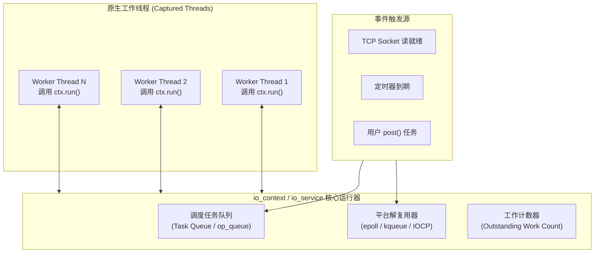
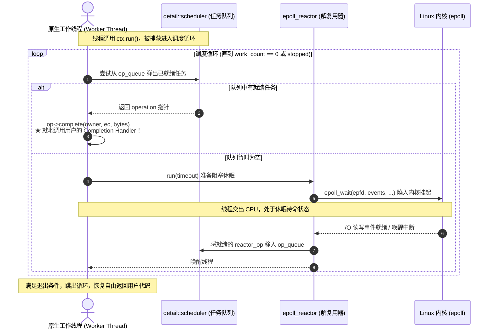
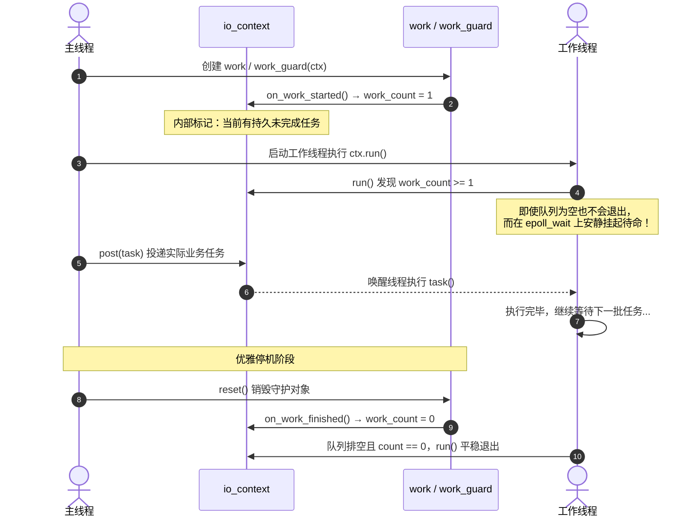
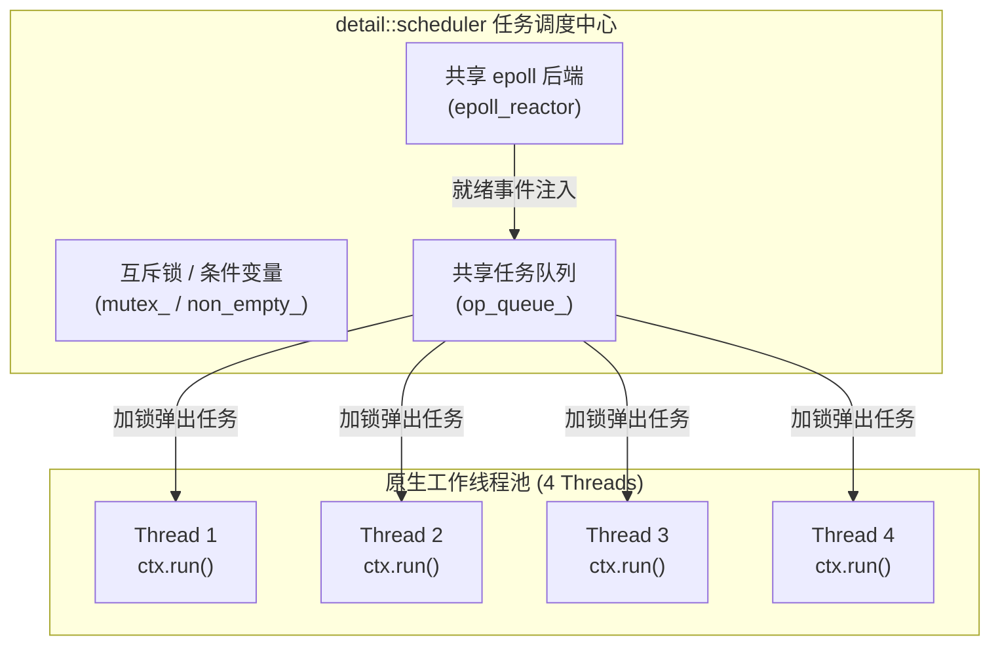
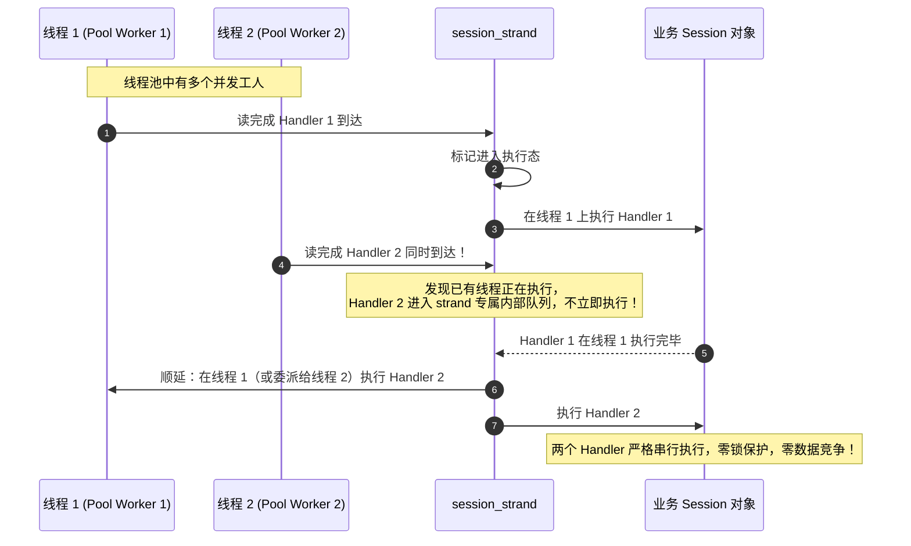

# 运行器与事件循环深度解析：从单线程捕获到多线程事件调度池

> 本文为 **Asio 工业级源码解构三部曲** 的第三篇（承接 [ARCHITECTURE.md](ARCHITECTURE.md) 与 [SESSION_LIFECYCLE.md](SESSION_LIFECYCLE.md)）。
> 核心聚焦：**事件循环运行器（Event Loop Runner）**、**线程捕获机制（Thread Capture）**、**常驻守护者（Work Guard）** 与 **工作线程池扩展（Thread Pool Runner / Strand）**。

---

## 1. 概念基石：什么是 Event Loop Runner？

在现代 C++ 网络与系统并发编程中，存在两种截然不同的架构范式：

1. **传统阻塞式多线程模型（Thread-per-Connection）**：每个连接绑定一个操作系统线程，线程在 `recv()` 或 `read()` 上阻塞休眠。当连接数暴增至几万时，线程上下文切换与栈内存消耗将直接拖垮操作系统。
2. **事件驱动反应器/前摄器模型（Event-Driven Reactor/Proactor）**：由一个核心**运行器（Runner）**驱动**事件循环（Event Loop）**，线程不再绑定单一连接，而是集中处理由操作系统（`epoll`/`kqueue`/`IOCP`）就绪的一批批完成回调（Completion Handlers）。

在 Boost.Asio（经典版）与 Standalone Asio（现代版）中，扮演这个运行器核心调度枢纽的就是 **`io_service`**（现代标准名称为 **`io_context`**）。



`io_context` 本身不拥有任何内部执行线程，它本质上是一个**多路复用调度器与任务队列**。真正赋予它生命力的，是**外部线程对其 `run()` 方法的调用**。

---

## 2. 事件循环捕获机制（Thread Capture）

### 2.1 什么是“线程捕获”？

当主线程或任意工作线程调用 `ios.run()` 时，该线程**放弃了原本线性的业务代码执行流**，被 `io_context` “捕获”进内部的调度死循环中：

```cpp
asio::io_context ctx;
// ... 注册异步操作 ...

// 这一行代码会直接“捕获”当前调用线程！
// 当前线程阻塞在此处，专职充当执行 Handlers 的 CPU 工人：
ctx.run();

// 只有当事件循环彻底结束（所有任务完成或显式 stop）后，线程才会脱离捕获从这里返回
std::cout << "Event loop exited!" << std::endl;
```

### 2.2 线程捕获下的内部执行状态机

`run()` 底层转调 `detail::scheduler::run()`。被捕获的线程在该循环中反复经历 **“任务窃取 -> 阻塞等待 -> 事件唤醒 -> 就地回调”** 的四步循环：



### 2.3 `run()` 正常退出的充要条件

`ctx.run()` 并不是死循环，它在满足以下**两个条件之一**时会立即返回：

1. **显式请求停止**：用户主动调用了 `ctx.stop()`；
2. **工作计数归零且队列为空**：系统内**没有任何未完成的异步操作**，且内部任务队列已全部清空。

这就引出了网络服务中最常见的经典 Bug：**“事件循环过早退出”**。

---

## 3. 常驻待命守护者：`io_service::work` 与 `executor_work_guard`

### 3.1 “过早退出”痛点剖析

在编写服务器或线程池框架时，我们通常在主线程启动若干工作线程：

```cpp
asio::io_context ctx;

// 启动 4 个工作线程捕获执行
std::vector<std::thread> workers;
for (int i = 0; i < 4; ++i) {
    workers.emplace_back([&ctx]() {
        ctx.run(); // ❌ 严重 BUG！
    });
}

// 主线程稍后才发起 async_accept 或 post 任务...
```

**后果**：当工作线程启动并调用 `ctx.run()` 时，由于主线程尚未开始投递异步任务，`ctx` 内部的未决工作计数为 `0`。工作线程一检查队列发现空无一物，**`run()` 瞬间执行完毕并直接退出！** 随后添加的异步操作将没有任何线程来执行。

### 3.2 守护机制：Work Count 计数器原理

为了让工作线程即使在没有任何 I/O 任务时也能**保持休眠待命**，Asio 引入了 **Work 守护对象**。



### 3.3 经典 vs 现代 C++ 对照

随着 C++11 到 C++20 的标准化进程，Asio 这一套 API 进行了重命名与概念解耦：

| 机制 | 经典 Boost.Asio (C++03/11) | 现代 Standalone Asio / C++17/20 | 演进原因 |
|---|---|---|---|
| **核心运行器** | `boost::asio::io_service` | `asio::io_context` | 遵循 Networking TS；区分执行环境（`execution_context`）与具体 I/O 服务 |
| **工作守护者** | `boost::asio::io_service::work` | `asio::executor_work_guard` | 解耦为通用的“执行器工作守卫”，不仅适用于 I/O，还适用于任意 Executor |
| **创建方式** | `std::unique_ptr<io_service::work> work(new io_service::work(ios));` | `auto work = asio::make_work_guard(ctx);` | RAII 风格工厂函数，自动推导底层执行器类型 |
| **释放守护** | `work.reset();` | `work.reset();` | 将未决工作计数减 1，允许事件循环自然退出 |

#### 现代标准写法：
```cpp
#include <asio.hpp>
#include <thread>
#include <vector>

asio::io_context ctx;

// 1. 创建工作守卫，使内部 work_count >= 1
auto work_guard = asio::make_work_guard(ctx);

// 2. 捕获线程，即使没有任务，线程池也会保持阻塞待命
std::vector<std::thread> threads;
for (int i = 0; i < 4; ++i) {
    threads.emplace_back([&ctx]() {
        ctx.run();
    });
}

// 3. 投递任务
asio::post(ctx, []() {
    std::cout << "Task running in captured thread: " 
              << std::this_thread::get_id() << std::endl;
});

// 4. 优雅停机：释放守护，等已排队任务全部处理完毕后，工作线程自然退出
work_guard.reset();
for (auto& t : threads) {
    t.join();
}
```

---

## 4. 扩展为工作线程池：Thread Pool Runner

### 4.1 多线程共享单个 `io_context` 的内核竞争模型

当我们在 $N$ 个原生线程上同时调用**同一个** `io_context` 的 `run()` 时，就构建起了一个高效的**共享工作线程池（Thread Pool Runner）**：



- **天然负载均衡**：任务放在中央共享队列 `op_queue` 中。哪个线程刚执行完上一任务空闲下来，就会立刻加锁抢占下一个 Handler 执行，不存在某线程忙死、其他线程闲死的情况。
- **动态就绪**：内核通过 `epoll_wait` 监听 I/O 事件，当事件就绪时，操作系统唤醒休眠的线程处理。

### 4.2 任务投递的三种语义：`post` vs `dispatch` vs `defer`

在多线程运行器中，向事件循环提交任务有三种不同粒度的语义：

| 接口 | 语义 | 行为细节 | 适用场景 |
|---|---|---|---|
| **`asio::post(ctx, f)`** | **强制异步排队** | 无论当前由哪个线程发起，任务 `f` 都**绝对压入队列尾部**，不能立即执行。 | 跨线程派发任务；避免长时间霸占当前调用栈 |
| **`asio::dispatch(ctx, f)`** | **就地或排队** | 若当前线程**正处于捕获当前 `ctx` 的线程内**，则**立即原地同步执行** `f()`；否则退化为 `post` 排队。 | 性能优化关键路径（避免无谓的任务进出队与上下文切换开销） |
| **`asio::defer(ctx, f)`** | **惰性稍后执行** | 提示调度器将任务推迟到当前任务链完成之后执行，通常放入本地任务队列。 | 消除深层递归展开（如读写回环中的栈溢出防护） |

---

## 5. 致命并发陷阱与保护护盾：`asio::strand`

### 5.1 致命陷阱：并发回调破坏线程安全！

多线程同时 `run()` 带来了并发吞吐量的提升，但带来了一个致命陷阱：**同一个 TCP 连接的异步回调可能被不同线程并发执行**！

```text
时间点 1：客户端发来第一段数据包 → epoll 读就绪 → Thread 1 从队列取出 Handler 并执行。
时间点 2：客户端紧接着发来第二段包 → epoll 又就绪 → Thread 2 同时从队列取出 Handler 并执行！
此时：Thread 1 和 Thread 2 在两个不同的 CPU 核心上，同时对同一个 session 对象、同一块缓冲区进行并发读写！
💥 后果：内存撕裂、数据竞争（Data Race）、崩溃（Crash）。
```

### 5.2 错误解法 vs 工业标准解法

- ❌ **低级做法：在 Session 内部到处加 `std::mutex`**
  - 代码极易死锁；
  - 线程反复在锁上阻塞，白白消耗 CPU 切换开销，抵消了多线程事件循环的高吞吐优势。
- ✅ **工业标准做法：`asio::strand`（免锁串行化调度器）**
  - `strand` 保证：**所有由同一个 `strand` 派发的 Handlers，绝对严格按照先后顺序串行执行，绝对不会发生多线程并发！**



### 5.3 现代 C++ 最佳实践代码

```cpp
#include <asio.hpp>
#include <iostream>
#include <memory>

class StrandEchoSession : public std::enable_shared_from_this<StrandEchoSession> {
public:
    StrandEchoSession(asio::ip::tcp::socket socket)
        : socket_(std::move(socket)),
          // 为每个连接绑定一个独立的 strand 执行器
          strand_(socket_.get_executor()) {}

    void Start() {
        DoRead();
    }

private:
    void DoRead() {
        auto self = shared_from_this();
        socket_.async_read_some(
            asio::buffer(data_),
            // ★ 核心：使用 asio::bind_executor 将 handler 绑定到 strand 上！
            // 无论底层哪个线程池 Worker 抢到这个 I/O 事件，都必须经过 strand 串行门禁排队！
            asio::bind_executor(strand_,
                [this, self](const asio::error_code& ec, std::size_t length) {
                    if (!ec) {
                        DoWrite(length);
                    }
                })
        );
    }

    void DoWrite(std::size_t length) {
        auto self = shared_from_this();
        asio::async_write(
            socket_, asio::buffer(data_, length),
            // ★ 写操作同样绑定到同一个 strand
            asio::bind_executor(strand_,
                [this, self](const asio::error_code& ec, std::size_t /*length*/) {
                    if (!ec) {
                        DoRead();
                    }
                })
        );
    }

    asio::ip::tcp::socket socket_;
    // 现代 Asio strand 类型
    asio::strand<asio::any_io_executor> strand_;
    char data_[1024];
};
```

---

## 6. 工业级并发架构对比与选型指南

在设计高吞吐服务器系统时，围绕 `io_context` 有以下三种成熟架构模型：

| 架构维度 | 模式 A：单线程单 Context | 模式 B：多线程池共享单 Context (本文重点) | 模式 C：多 Context Thread-per-Core |
|---|---|---|---|
| **拓扑设计** | 1 个 `io_context` + 1 个 `run()` 线程 | 1 个 `io_context` + $N$ 个线程并发调用 `run()` | $N$ 个独立的 `io_context`，每个单独绑定 1 个线程 |
| **工业代表** | Node.js、Redis | Java Netty 默认配置、Windows IOCP 典型工程 | NGINX、Seastar、DPDK 用户态网络框架 |
| **负载均衡** | ❌ 无法利用多核 CPU | ✅ **自动负载均衡**（哪个工人闲谁取任务） | ⚠️ 需手动哈希或轮询（Round-Robin）分发 socket |
| **临界区开销** | 🟢 **纯无锁**（单线程无竞争） | 🟡 调度队列有互斥锁开销；**必须使用 `strand`** | 🟢 **各线程完全无锁、隔离**，CPU 缓存局部性极高 |
| **编程心智** | 极低 | 中等（牢记连接与 `strand` 绑定） | 高（连接跨线程转移难度大） |
| **最佳应用场景** | 客户端程序、轻量中转网关 | **通用高并发企业级后台**、计算耗时浮动大的业务 | **极致高吞吐、超低时延网络基座**（如量化交易） |

---

## 7. 生产级完整线程池运行器参考实现

以下为一个生产级封装的 `ThreadPoolRunner`，展示完整的生命周期保护、优雅停机与异常防护：

```cpp
#include <asio.hpp>
#include <iostream>
#include <thread>
#include <vector>
#include <functional>

class ThreadPoolRunner {
public:
    explicit ThreadPoolRunner(std::size_t pool_size)
        : work_guard_(asio::make_work_guard(io_context_)) {
        threads_.reserve(pool_size);
        for (std::size_t i = 0; i < pool_size; ++i) {
            threads_.emplace_back([this, i]() {
                WorkerThreadLoop(i);
            });
        }
    }

    ~ThreadPoolRunner() {
        Stop();
    }

    // 提交普通并发任务
    template <typename F>
    void Post(F&& task) {
        asio::post(io_context_, std::forward<F>(task));
    }

    // 优雅停机：释放守护，等待所有未决任务排空执行完成
    void Stop() {
        if (!stopped_) {
            stopped_ = true;
            // 1. 释放工作守护，允许 work_count 归零
            work_guard_.reset();
            // 2. 等待所有被捕获线程退出 run()
            for (auto& t : threads_) {
                if (t.joinable()) {
                    t.join();
                }
            }
        }
    }

    // 紧急停机：立刻取消并丢弃所有队列任务
    void StopImmediate() {
        io_context_.stop();
        Stop();
    }

    asio::io_context& GetContext() { return io_context_; }

private:
    void WorkerThreadLoop(std::size_t thread_id) {
        try {
            // 线程被捕获，进入事件调度死循环
            io_context_.run();
        } catch (const std::exception& e) {
            std::cerr << "[Fatal Error in Worker " << thread_id << "]: " 
                      << e.what() << std::endl;
        }
    }

    asio::io_context io_context_;
    // 现代工作守护对象，保证 io_context 在无任务时不提前退出
    asio::executor_work_guard<asio::io_context::executor_type> work_guard_;
    std::vector<std::thread> threads_;
    bool stopped_{false};
};
```

---

## 8. 总结与知识点贯通

1. **`run()` 的本质是“捕获（Capture）”**：原生操作系统线程调用 `run()` 后，主动交出控制权沦为事件循环的执行工具，专职原地调用各类完成处理器。
2. **`work` 的作用是“常驻守护”**：防止空闲时的“闪退”，通过维护未决工作计数让工作线程池平稳处于待命状态；停机时必须先 `reset()` 守护，再等待线程 `join()`。
3. **多线程并发必须依赖 `strand` 筑起安全护盾**：共享 `io_context` 的多线程池自动实现了负载均衡，但对于同一个连接的有状态操作，必须通过 `asio::bind_executor(strand, ...)` 杜绝数据竞争。
