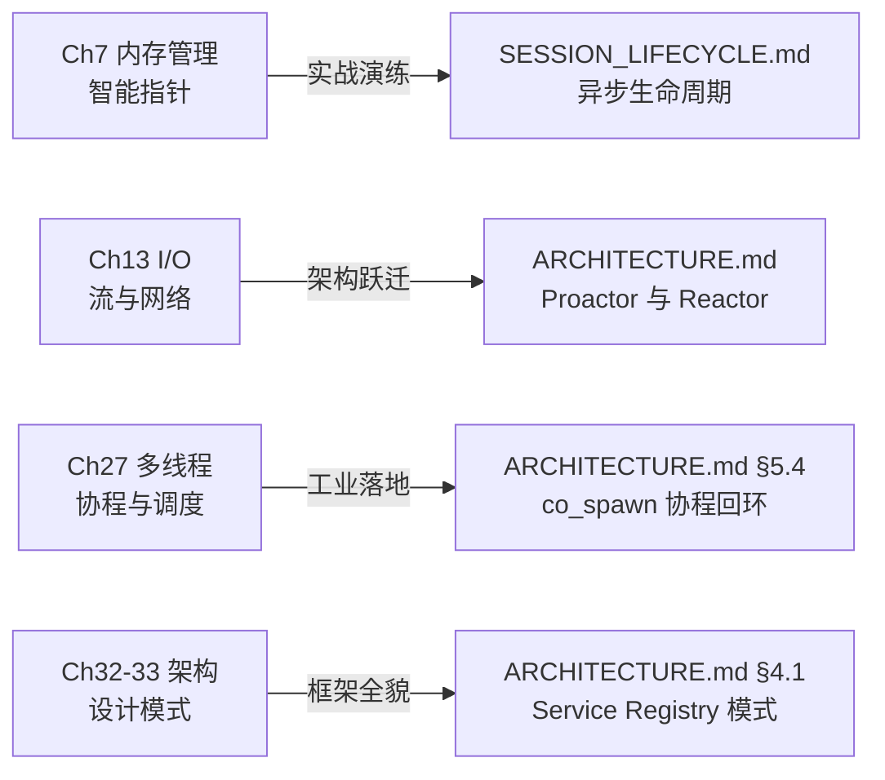

# 经典工业级框架源码解构 · Asio

> 本专题为 **Professional C++ Learning** 的工业级框架进阶拓展模块。
> 基于 Asio 1.38.2（Standalone 现代 C++ 模式）编写，旨在将教材中的现代 C++ 理论与顶级工业级网络/异步基础设施深度对照。

---

## 1. 为什么选择 Asio 作为首选解构对象？

在 C++ 工程生态中，**Asio**（Boost.Asio 的独立无 Boost 依赖版本）占据着举足轻重的地位：

1. **C++ 网络与异步的事实标准**：ISO C++ Networking TS（网络技术规范）与 P0443 执行器模型的核心提案原型即源于 Asio。
2. **Proactor 架构模式的最高水准落地**：封装了各平台最底层的异步 I/O 复用技术（Linux `epoll` / `io_uring`、Windows `IOCP`、macOS `kqueue`）。
3. **现代 C++ 语言特性的集大成者**：
   - **智能指针与所有权（Ch7）**：工业界中 `std::enable_shared_from_this` 解决异步 use-after-free 的最经典范例。
   - **泛型完成模型（Ch12）**：`async_result` 定制点机制，一套 API 无缝适配回调、`std::future`、协程与惰性执行对象。
   - **C++20 协程落地（Ch27）**：`co_spawn` 与 `use_awaitable` 是目前生产环境最为成熟的协程事件循环基础设施。
   - **框架与设计模式（Ch32–33）**：Service Registry（单例服务模式）、Strand（免锁串行化调度器）、Executor 抽象。

---

## 2. 专题文档导航

| 核心文档 | 核心内容 | 推荐阅读阶段 |
|---|---|---|
| [📘 总体分层架构与底层机制 (ARCHITECTURE.md)](ARCHITECTURE.md) | 总体分层架构、核心运行时类层次、Proactor 机制、异步完成模型、SSL 装饰器模式、Reactor 驱动流程（含 13 幅标准 Mermaid 架构图与时序图） | **Ch13 I/O 篇**<br/>**Ch27 协程篇**<br/>**Ch32-33 架构篇** |
| [📗 智能指针与异步生命周期实践 (SESSION_LIFECYCLE.md)](SESSION_LIFECYCLE.md) | 异步操作与栈帧生命周期错配、`shared_from_this` 绑定三要素、Lambda 捕获原则、循环引用与容器安全（含 7 幅完整引用计数演变时序图） | **Ch7 智能指针篇** |
| [💻 核心实战代码示例 (examples/)](examples/) | 阻塞式 Echo、标准 `shared_from_this` 异步 Echo、C++20 协程 Echo 服务器，配有一键构建脚本 | 随读随练 |

---

## 3. 课程体系双向锚定指南

在研读本书主线课程时，建议在以下时间节点结合本专题拓展学习：



### 锚点 1：Ch7 内存管理（智能指针与生命周期）
- **教材痛点**：教科书常以玩具类演示 `std::enable_shared_from_this`，初学者难以体会为什么必须有它、什么时候必须捕获。
- **Asio 对照**：精读 [SESSION_LIFECYCLE.md](SESSION_LIFECYCLE.md)。异步调用发起即返回，发起者的栈帧瞬间瓦解；唯有将 `self = shared_from_this()` 随 Lambda 存入底层操作队列，才能精准保证内核事件触发时对象依然存活，且全部完成自动析构。

### 锚点 2：Ch13 I/O（标准流 vs 异步网络）
- **教材痛点**：标准库仅提供阻塞式 `iostream`，现代高性能服务器需要基于事件的多路复用机制。
- **Asio 对照**：精读 [ARCHITECTURE.md](ARCHITECTURE.md) 的第 1–3 节。理解非阻塞 I/O、Scatter/Gather 内存连续/离散缓冲区（`mutable_buffer` / `const_buffer`）以及跨平台 Reactor 后端抽象。

### 锚点 3：Ch27 多线程与并发（C++20 协程实战）
- **教材痛点**：C++20 协程（`co_await` / `co_return` / `std::coroutine_handle`）底层概念繁杂，缺乏完整的事件循环运行时驱动。
- **Asio 对照**：精读 [ARCHITECTURE.md](ARCHITECTURE.md) 的第 4.4 节与第 5.4 节。体验 Asio 如何通过 `async_result<use_awaitable_t>` 优雅地将协程挂起点桥接到 `io_context` 事件循环中。

### 锚点 4：Ch32–33 框架设计与设计模式
- **教材痛点**：设计模式往往停留于 UML 理论图。
- **Asio 对照**：精读 [ARCHITECTURE.md](ARCHITECTURE.md) 的第 4.1 节。学习 Asio 的**服务注册中心（Service Registry）**模式：前端句柄对象（`tcp::socket`）零状态极轻，后端服务（`reactive_socket_service`）单例集中持有系统调用与状态机。

---

## 4. 示例快速编译与运行

本模块提供的示例均基于纯 Standalone 模式编写，无需本地安装几百兆的 Boost 完整库。

```bash
# 1. 进入 examples 目录
cd frameworks/asio/examples

# 2. 生成并构建（自动拉取轻量 standalone asio 头文件）
cmake -B build
cmake --build build

# 3. 运行测试（例如异步 TCP Echo 服务器）
./build/02_async_tcp_echo 8080

# 4. 在另一终端使用 netcat 测试
nc 127.0.0.1 8080
```
