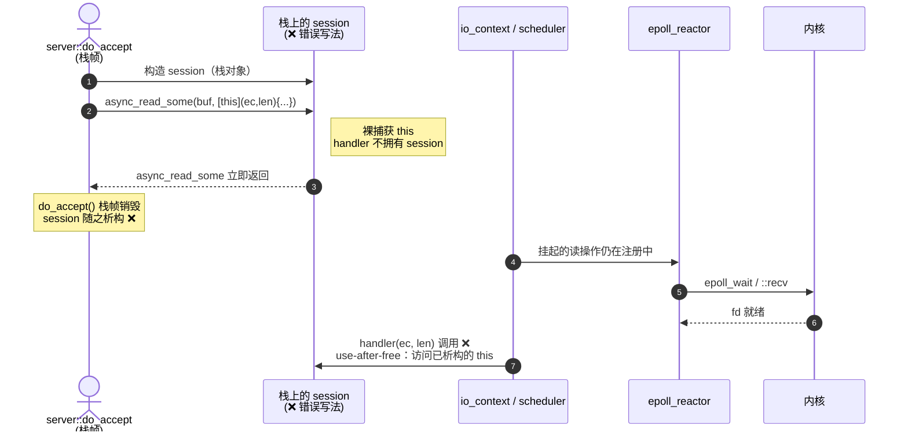
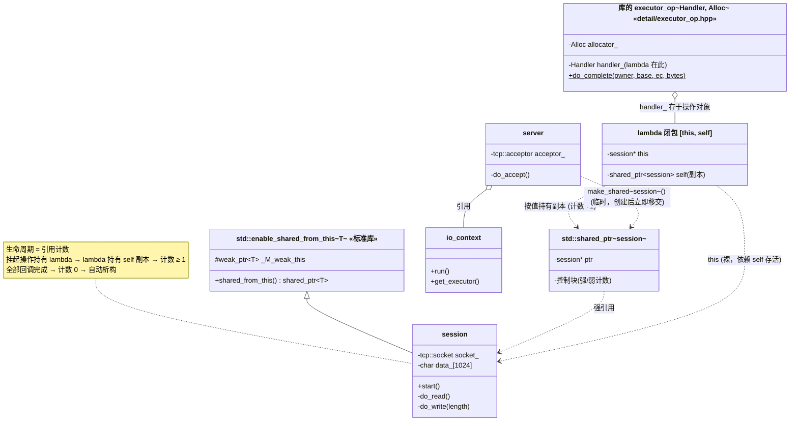
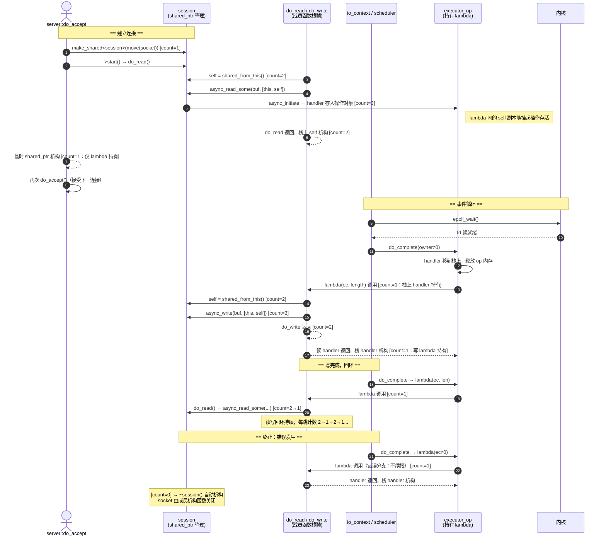
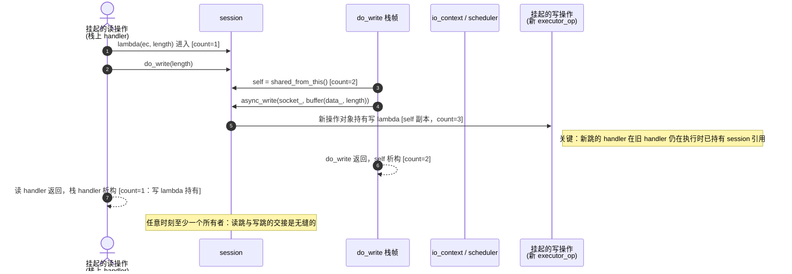
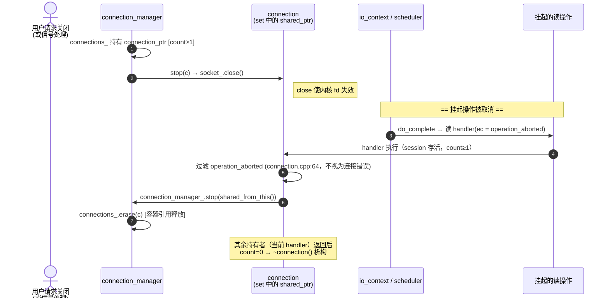
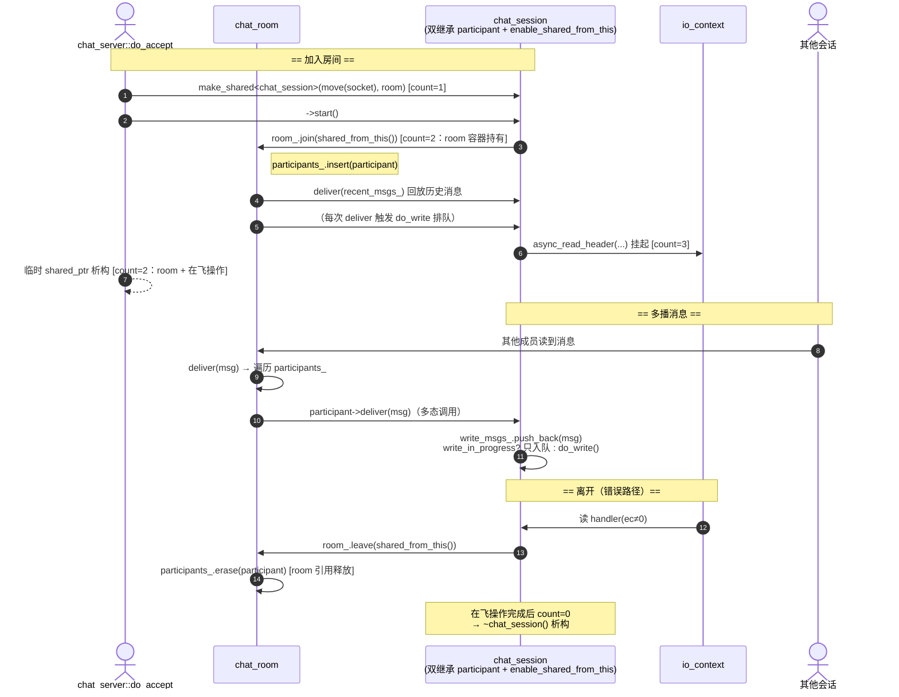
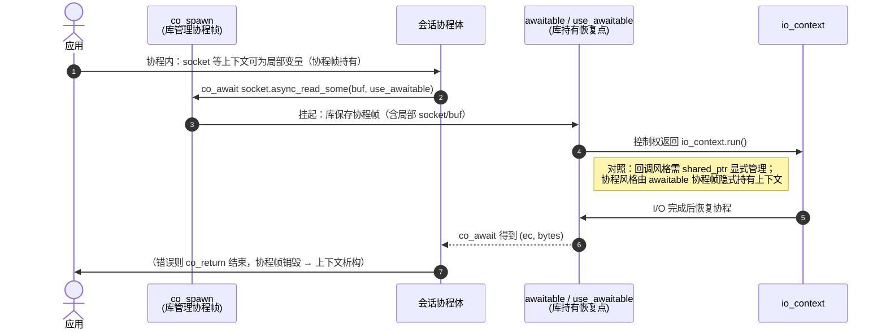

# Asio 智能指针使用场景：异步会话（Session）生命周期管理

> 基于 [README.md](README.md) 与 [ARCHITECTURE.md](ARCHITECTURE.md) | 版本 1.38.2
>
> 所有结论均标注源码出处；所有图均采用标准 Mermaid 格式编写，在 GitHub 及 VS Code 中可原生渲染。

---

## 1. 问题：异步操作与栈变量生命周期的错配

异步操作（`async_write` / `async_read`）发起后**立即返回**，发起它的函数栈帧随之销毁。若连接上下文（socket、缓冲区、状态机）放在栈上或仅由裸指针持有，当 OS 层 I/O 稍后完成、库回调处理器时，上下文早已析构 —— **use-after-free**。



**结论**：异步操作挂起期间，必须有一个"活着的所有者"持有上下文 —— 这就是 `std::shared_ptr` 的职责。

---

## 2. 解决方案：shared_ptr 生命周期绑定三要素

以本仓库 `example/cpp11/echo/async_tcp_echo_server.cpp` 为准（行号对应源文件）：

```cpp
// 要素 1：Session 封装连接上下文，并从 shared_ptr 派生自身管理能力
class session
  : public std::enable_shared_from_this<session>      // :20
{
  tcp::socket socket_;        // :60  连接 socket（值成员，随 session 存活）
  char data_[max_length];     // :62  缓冲区（值成员）
};

// 要素 2：创建与启动 —— make_shared + start
std::make_shared<session>(std::move(socket))->start(); // :82

// 要素 3：每个异步 Handler 按值捕获 shared_ptr
void do_read()
{
  auto self(shared_from_this());                       // :36
  socket_.async_read_some(                             // :37
      boost::asio::buffer(data_, max_length),
      [this, self](boost::system::error_code ec, std::size_t length) // :38
      {
        if (!ec) { do_write(length); }
      });
}
```

三个要素的分工：

| 要素 | 作用 |
|---|---|
| `enable_shared_from_this<session>` | 使成员函数内部能安全取得自己的 `shared_ptr`（`shared_from_this()`） |
| `std::make_shared<session>(std::move(socket))` | 单次分配创建 session；accept 后立即把 socket **移动**进 session（无拷贝） |
| `[this, self]` 按值捕获 | handler 对象内部持有一份 `shared_ptr<session>` 副本 → **引用计数 +1**；回调执行期间 session 必然存活 |

核心机制：**引用计数随未完成的异步操作自动延长**。handler 被库存入操作对象中直到完成回调；回调执行完后，若未发起下一跳异步操作，最后一个 `shared_ptr` 归零 → session 自动析构。

### 2.1 深度拆解经典单行：std::make_shared<session>(std::move(socket))->start()

这行代码是 Asio 乃至现代 C++ 网络架构中**最经典、最具巧思的单行代码之一**：

```cpp
std::make_shared<session>(std::move(socket))->start();
```

一句话概括其本质：**“在堆上创建会话对象、移交底层 OS 套接字所有权、启动首个异步操作，并立即将会话生命周期全权委托给内核事件循环（自驱动生命周期，无需任何外部容器集中维护）。”**

#### ① 四大核心动作细剖

1. **`std::move(socket)`（所有权移交）**：
   `tcp::socket` 封装了操作系统的套接字文件描述符（fd），它是**独占且仅支持移动（move-only）**的资源。通过 `std::move` 将服务器 acceptor 刚接入的 socket 所有权转移进新建的 `session` 成员变量中，杜绝浅拷贝与资源泄露。
2. **`std::make_shared<session>(...)`（单次分配与弱指针绑定）**：
   在堆上单次分配连续内存块构造 `session` 对象与其控制块（Control Block）。更关键的是：因为 `session` 继承了 `std::enable_shared_from_this<session>`，`std::make_shared` 在构造完成后会**自动将其内部的 `_M_weak_this` 弱指针初始化并绑定到该控制块**，使成员函数能合法调用 `shared_from_this()`。此时生成一个临时 `shared_ptr`，强引用计数 `count = 1`。
3. **`->start()`（接力棒交接与操作排队）**：
   通过临时指针调用 `session::start()`，进入 `do_read()`：
   - 内部通过 `auto self = shared_from_this();` 获得新的强引用（`count = 2`）；
   - 发起 `socket_.async_read_some(..., [this, self](...){ ... })`，Lambda 闭包**按值复制**持有一份 `self` 并存入底层操作队列中（`count = 3`）；
   - `start()` 与 `do_read()` 栈帧返回，局部变量 `self` 析构（`count = 2`）。
4. **分号 `;` 触发临时指针析构（真正玄机）**：
   语句结束时，`std::make_shared` 返回的匿名临时 `shared_ptr` 立即被析构！
   计数减 1（变为 `count = 1`，仅由事件循环队列中的 Lambda 持有）。**对象并未被销毁，反而成功完成从“栈启动”到“异步队列托管”的无缝交接**。

#### ② 引用计数演进时序图

```mermaid
sequenceDiagram
    autonumber
    participant Server as Server 栈帧
    participant Session as Session 对象 (堆)
    participant OpQueue as Asio 事件循环 / 内核

    Note over Server, Session: 1. 执行语句：std::make_shared<session>(...)->start();
    Server->>Session: make_shared 创建对象<br/>[强引用计数 count = 1]
    Server->>Session: 调用 ->start()
    
    Session->>Session: self = shared_from_this()<br/>[count = 2]
    Session->>OpQueue: async_read_some(..., [this, self])<br/>Lambda 副本被放入异步队列 [count = 3]
    Session-->>Server: start() 执行完毕返回，局部 self 析构<br/>[count = 2]

    Note over Server: 2. 遇到分号 ';'，临时 shared_ptr 析构！
    Server-->>Server: 临时 shared_ptr 销毁<br/>[count = 1：仅队列中的 Lambda 拥有]

    Note over OpQueue, Session: 3. 数据到来，触发回调
    OpQueue->>Session: 执行 Lambda(ec, len) [count = 1]
    alt 正常读写
        Session->>OpQueue: 发起 async_write(..., [this, self]) 接力<br/>[count 维持在 1 ~ 2 波动]
    else 客户端断开 / 出错
        Session->>Session: 不再发起新的异步操作
        Note over Session: Lambda 执行完毕退出，最后一个 self 副本析构！<br/>[count = 0] → 自动触发 ~session() 销毁资源
    end
```

#### ③ 为什么这是 Modern C++ 的顶级范式？
- **零 use-after-free 隐患**：异步操作跨越函数栈生命周期，闭包持有强引用保证回调执行时对象必定存活；
- **自驱动、自销毁（Self-governing Lifecycle）**：无需额外定义全局 `std::vector<session*>` 或复杂锁机制维护连接生命周期。有未决 I/O 则存活，I/O 终止则引用归零自析构，彻底消除了内存泄漏。

---

## 3. 源码实证：本仓库的三个典型使用场景

### 3.1 场景 A —— 最简回环：链式续接（echo server）

`example/cpp11/echo/async_tcp_echo_server.cpp`

- `session` 继承 `enable_shared_from_this`（:20）；
- `do_read()`（:34）与 `do_write()`（:47）**互相续接**形成读-写回环，每跳都重新 `shared_from_this()` 并按值捕获（:36-38、:49-51）；
- `server::do_accept()`（:75-87）在 accept 回调里 `make_shared<session>(std::move(socket))->start()`，随后无条件再次 `do_accept()`（:85）维持接受循环。

**适用**：单连接、无共享容器、生命周期完全由"未完成异步操作"驱动。

### 3.2 场景 B —— 容器集中管理：工厂 + Manager（http/server）

`example/cpp11/http/server/connection.hpp` / `connection.cpp` / `connection_manager.hpp`

- `connection` 继承 `enable_shared_from_this`，**禁止拷贝**（connection.hpp:32-33）；
- 定义 `typedef std::shared_ptr<connection> connection_ptr;`（connection.hpp:74）；
- `connection_manager` 持有 `std::set<connection_ptr> connections_;`（connection_manager.hpp:42），提供 `start/stop/stop_all`；
- 错误路径主动归还所有权：`do_read`/`do_write` 失败时调用 `connection_manager_.stop(shared_from_this())`（connection.cpp:66、:87），且显式**过滤 `operation_aborted`**（connection.cpp:64、:85）—— 服务器主动关闭触发的取消不视为错误；
- 成功路径优雅关闭：`do_write` 完成后 `socket_.shutdown(shutdown_both, ignored_ec)`（connection.cpp:81）再 `stop()`；
- `stop()` 本身只是 `socket_.close()`（connection.cpp:32-35）→ 使挂起的异步操作以 `operation_aborted` 完成。

**适用**：需要全局管理连接集合（优雅停机、踢出连接）、在容器移除时才真正销毁。

### 3.3 场景 C —— 容器持有 + 多播：Room 模式（chat server）

`example/cpp11/chat/chat_server.cpp`

- 抽象接口 `chat_participant` + `typedef std::shared_ptr<chat_participant> chat_participant_ptr;`（:29-36）；
- `chat_room` 持有 `std::set<chat_participant_ptr> participants_;`（:66），`join()`（:43）/ `leave()`（:50）/ `deliver()`（:55）多播消息；
- `chat_session` 双继承：`chat_participant`（多态接口）+ `enable_shared_from_this<chat_session>`（生命周期）（:73-75）；
- `start()` 先 `room_.join(shared_from_this())`（:86）—— **room 立即持有一份引用**，session 的存活不再仅依赖未完成操作；
- 三处错误路径都以 `room_.leave(shared_from_this())`（:114、:133、:156）从容器移除 → 计数归零 → 析构；
- `deliver()` 用 `write_in_progress` 判断（:92-97）：写队列非空只入队，避免并发写同一 socket —— 这是"每会话写队列"的惯用法。

**适用**：会话间协作（聊天室、广播）、会话被容器与其他组件共同持有。

---

## 4. 库内部支持：Asio 如何持有你的 Handler（源码）

应用层捕获的 `self` 存活在 handler 对象内，而 handler 对象由库的**操作对象**持有。源码：`include/boost/asio/detail/executor_op.hpp`

```cpp
template <typename Handler, typename Alloc,
    typename Operation = scheduler_operation>
class executor_op : public Operation            // :30-32 操作对象基类
{
  static void do_complete(void* owner, Operation* base, ...)  // :45
  {
    executor_op* o(static_cast<executor_op*>(base));
    // ...（省略）
    // 源码注释（:57-62）："Make a copy of the handler so that the memory
    // can be deallocated before the upcall is made."
    Handler handler(static_cast<Handler&&>(o->handler_));     // :63 handler 移到栈上
    p.reset();                                                // :64 释放 op 内存
    if (owner)                                                // :67
    {
      static_cast<Handler&&>(handler)();                      // :71 调用用户 handler
    }
  }
  Handler handler_;   // :77  ← 你捕获的 shared_ptr<session> 就在这里
};
```

关键机制（均已核实源码）：

| 机制 | 源码 | 说明 |
|---|---|---|
| 操作对象基类 | `detail/scheduler_operation.hpp:33` | `scheduler_operation` 用函数指针 `func_(owner, this, ec, bytes)` 派发，**非虚函数**（避免开销） |
| 所有权语义 | `scheduler_operation.hpp:42-49` | `complete()`（`owner != 0`）= "接管并回调"；`destroy()`（`owner == 0`）= "仅销毁"；基类析构为 protected（防止经基类删除） |
| handler 内存管理 | `executor_op.hpp:63-64` | 回调**之前**先把 handler 移到栈上、再释放操作对象内存 —— 保证 handler（及其捕获的 session shared_ptr）在整个 upcall 期间存活 |
| 平台统一 | `detail/operation.hpp:25-31` | 非_IOCP 平台 `operation = scheduler_operation`；IOCP 平台 `operation = win_iocp_operation`，语义相同 |

**层次对照**：库层面用**所有权转移**（`owner` 参数语义，操作对象独占 handler 内存直到回调）；应用层用 **shared_ptr 引用计数**（多个未完成操作共享 session）。两层正交组合，构成完整的生命周期保障。

---

## 5. 引用计数动态变化全表（echo 场景逐步）

以场景 A 为例，跟踪 `session` 的 `use_count()`：

| 步骤 | 事件 | use_count | 持有者 |
|---|---:|---|---|
| 1 | accept 回调：`make_shared<session>` | 1 | make_shared 返回的临时 shared_ptr |
| 2 | `->start()` → `do_read()`：`shared_from_this()` → 栈上 `self` | 2 | 临时 + do_read 的 self |
| 3 | lambda 按值捕获 `self`（handler 构造） | 3 | 临时 + self + lambda 内副本 |
| 4 | `do_read()` 返回，栈上 `self` 析构 | 2 | 临时 + lambda 内副本 |
| 5 | `start()` 返回，临时 shared_ptr 析构 | **1** | **仅 lambda 内副本**（存于库的 executor_op 中，随挂起的读操作存活） |
| 6 | 读完成：`do_complete` 把 handler 移到栈上 | 1 | 栈上的 handler（所有者换了，计数不变） |
| 7 | handler 内 `do_write(length)`：`shared_from_this()` → self → lambda 捕获 | 3 | 栈 handler + self + 写 lambda |
| 8 | `do_write` 返回（self 析构）→ 读 handler 返回（栈 handler 析构） | 1 | 仅写 lambda（存于挂起的写操作） |
| 9 | （步骤 6-8 循环若干轮……） | 1 | 当前跳的 lambda |
| 10 | 某次读写返回错误：handler **不**续接，直接返回 | 0 | （无）→ **`~session()` 自动析构**，socket 由成员析构关闭 |

要点：

- 计数在"**跨操作边界**"时降到 1（仅挂起操作的 lambda 持有），而不是 0 —— 这正是生命周期绑定；
- `self` 局部副本在成员函数返回时立即释放，不会累积 —— 每跳只增加"在飞"的计数；
- 析构发生在**最后一个 handler 返回时**（库回调栈帧内），不发生在 `io_context` 之外。

---

## 6. UML 类图：Session 与 enable_shared_from_this



---

## 7. UML 时序图：完整生命周期与调用流程

### 7.1 正解：echo 场景完整生命周期（含引用计数标注）



### 7.2 链式续接中的 self 传递（echo do_read → do_write）



### 7.3 容器集中管理：connection_manager 的 stop 流程（http/server）



### 7.4 容器持有 + 多播：chat_room 的 join/leave 生命周期



### 7.5 对比：协程场景下 shared_ptr 的角色变化



---

## 8. 详细调用流程（文字逐步）

以场景 A（echo）的**一次完整读-写往返**为例，从库内部到应用层：

**阶段一：连接建立**

1. `server::do_accept()`（async_tcp_echo_server.cpp:75）调用 `acceptor_.async_accept(...)`；
2. 库内：`async_initiate(initiate_async_accept{}, token)` → `basic_socket_acceptor` 的服务创建 accept 操作对象，`epoll_ctl` 注册监听 fd 可读事件；
3. 客户端连接到达 → `epoll_wait` 返回 → 操作完成 → accept 回调执行，得到新 `tcp::socket`；
4. 应用：`std::make_shared<session>(std::move(socket))->start()`（:82）—— socket **移动**进 session（heap 分配 1 次）。

**阶段二：读操作挂起（生命周期绑定点）**

5. `session::do_read()`（:34）：`auto self(shared_from_this())` —— 从弱引用 `_M_weak_this` 升级出强引用；
6. `socket_.async_read_some(buffer(data_, max_length), [this, self]{...})`（:37）；
7. 库内：`async_result::initiate` 用 token（lambda）生成真实 handler → 服务创建 `reactive_socket_recv_op`（内含 executor_op，**持有 lambda 副本**）→ `epoll_ctl(ADD)` 注册读事件；
8. `do_read` 返回 → 栈上 `self` 析构；`start` 返回 → 临时 shared_ptr 析构。此刻 **use_count == 1，唯一持有者是存于操作对象内的 lambda**。只要读操作挂起，session 必然存活。

**阶段三：完成回调（库内部）**

9. `io_context::run()` 的调度循环中 `epoll_wait` 报告 fd 就绪；
10. reactor 标记 `reactive_socket_recv_op` 完成（`perform()` 执行 `::recv` 搬运数据）→ 操作入任务队列；
11. `scheduler` 调 `op->complete(owner, ec, bytes)` → `executor_op::do_complete`（executor_op.hpp:45）：
    - 把 handler（lambda，内含 self 副本）**移到栈上**（:63）；
    - `p.reset()` 释放操作对象内存（:64）—— 在调用用户代码**之前**完成，避免 upcall 中再次分配；
    - 调用 lambda（:71）。**此刻 session 由栈上 handler 持有（count==1），回调期间绝对安全。**

**阶段四：回环续接与最终析构**

12. lambda 检查 `ec`：成功 → `do_write(length)`（:42）→ 重复阶段二的绑定点（写操作持有新 lambda）→ 读 handler 返回 → 计数安全交接给写跳；
13. 写完成回调同理续接 `do_read`；如此循环；
14. **终止**：某次读写返回错误（对端关闭、`operation_aborted` 等），lambda 错误分支不续接 → handler 返回 → 栈上最后一个 shared_ptr 析构 → **use_count == 0 → `~session()` 在库回调栈帧内自动执行**，`socket_` 成员析构关闭 fd。

---

## 9. 反模式与最佳实践

### 反模式（均会导致 use-after-free 或 UB）

| 反模式 | 问题 | 正确做法 |
|---|---|---|
| handler 捕获裸 `this`（session 为栈对象或所有权不在 handler） | 异步期间 session 可能已析构 | `enable_shared_from_this` + 按值捕获 `self` |
| 捕获栈上缓冲区的指针/引用 | 栈帧销毁后缓冲区失效 | 缓冲区作为 session 的**值成员**（如 `char data_[1024]`），随 session 存活 |
| 在构造函数中调用 `shared_from_this()` | `weak_this` 尚未初始化 → bad_weak_ptr | 构造后由外部 `make_shared`，在 `start()` 中使用 |
| session 由裸 `new` 创建、`shared_ptr` 后补 | `enable_shared_from_this` 依赖"已由 shared_ptr 管理" | 一律 `std::make_shared<T>(...)` |
| 容器持有 `shared_ptr` + session 又持有容器的 `shared_ptr` | 循环引用 → 永不析构 | 容器用 `shared_ptr`，session 持容器的**引用**（chat 源码：`chat_room& room_`，:162） |
| 错误路径不清理容器引用 | session 泄漏（计数永不归零） | 错误分支显式 `stop(shared_from_this())` / `room_.leave(...)` |

### 最佳实践（源自本仓库示例）

1. **每跳重新捕获**：`do_read`/`do_write` 各自 `shared_from_this()`，不跨跳传递裸 `this`（echo :36、:49）。
2. **取消不算错误**：`operation_aborted` 显式过滤（connection.cpp:64、:85），避免主动关闭时误报。
3. **容器持有者决定销毁时机**：需要集中管理时用 Manager/Room 持有 `shared_ptr`，销毁时机与"在飞操作"解耦。
4. **写队列防并发**：`write_in_progress` 标志 + 每会话写队列（chat :92-97），同一 socket 上避免重叠写操作。
5. **调试工具**：编译期定义 `BOOST_ASIO_ENABLE_HANDLER_TRACKING`，配合 `tools/handlerlive.pl`（查找存活处理器，即泄漏的 session）与 `tools/handlertree.pl`、`tools/handlerviz.pl` 分析调用树。

---

## 10. 与 C++20 协程的对比

| 维度 | 回调 + shared_ptr | 协程（co_spawn / awaitable） |
|---|---|---|
| 上下文持有 | 显式：Session 类 + `shared_ptr` 计数 | 隐式：协程帧持有局部 `socket`、缓冲区 |
| 生命周期保证 | 挂起操作的 lambda 持有 self 副本 | `awaitable` 协程帧由 `co_spawn`/库持有 |
| 顺序性 | 需手工链式续接（do_read/do_write 互调） | 顺序代码：连续 `co_await` |
| 错误处理 | 每个 handler 检查 `ec` | `throw_with_ec` / try-catch，一处处理 |
| 适用 | C++11/14、极致性能、老代码 | C++20+、新项目首选 |

回调模式（shared_ptr 绑定）仍是**协程的基础**：`use_awaitable` 的完成处理器内部同样持有协程恢复点，机制同构，只是由库代管。

---

## 参考源码（本仓库）

| 文件 | 内容 |
|---|---|
| `example/cpp11/echo/async_tcp_echo_server.cpp` | 场景 A：最简 shared_ptr 生命周期绑定 |
| `example/cpp11/http/server/connection.{hpp,cpp}` | 场景 B：工厂 + 容器管理 + operation_aborted 过滤 |
| `example/cpp11/http/server/connection_manager.hpp` | `std::set<connection_ptr>` 集中管理 |
| `example/cpp11/chat/chat_server.cpp` | 场景 C：Room 容器持有 + 多播 + leave |
| `include/boost/asio/detail/executor_op.hpp` | 库内部 handler 所有权管理（先释放后调用） |
| `include/boost/asio/detail/scheduler_operation.hpp` | 操作对象基类与 `owner` 所有权语义 |
